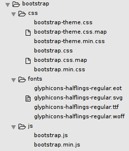
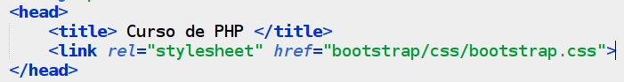

## 0.1 - Bootstrap? Diabéisso? {#0-1-bootstrap-diab-isso}

O bootstrap é um framework front-end que facilita a vida de milhares de desenvolvedores de todo o mundo, com ele é possível criar páginas web responsivas, ou seja, pra todo tamanho de tela, e o melhor, não precisamos escrever uma linha de CSS sequer.

Apenas com a parte do CSS já é possível fazer maravilhas, mas além disso o Bootstrap possui vários componentes JQuery que para implementar em seu projeto, por exemplo: modal, tooltip, popover, menu-dropdown, carousel, slideshow, tab, entre outros.

O Bootstrap se encontra atualmente disponível através do link [http://getbootstrap.com](http://getbootstrap.com/). Um Software Livre que possui a licença MIT.

Vamos baixar o arquivo que está disponível no site, descompactar, e conhecer sua estrutura:

Certo, temos aqui 3 diretórios: **css**, **fonts**, **js**.

Em cada um deles temos alguns arquivos, no diretório css temos vários, mas apenas 2 irão nos interessar no momento, o _bootstrap.css_ e o _bootstrap.min.css_ que na verdade fazerm o mesmo trabalho, a diferença é apenas porque um está comprimido e é mais leve, mas por motivos de poder alterar mais facilmente o código, vamos utilizar o _bootstrap.css_.

Já no diretório fonts, temos os arquivos que nos possibilitam vários icones para melhorar o visual das páginas.

No diretório js, temos o javascript/JQuery necessário pros efeitos mais interessantes do bootstrap.

Vamos a um exemplo de implementação, isso é bem simples, basta incorporar o arquivo .css no seu HTML, observe:

Pronto, com isso basta agora usar as classe do Bootstrap e usar sua criatividade.