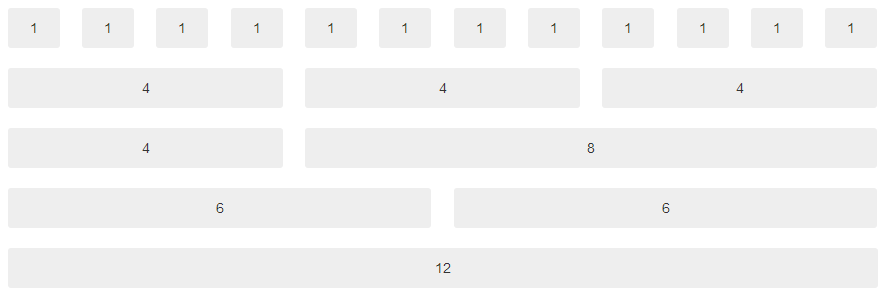
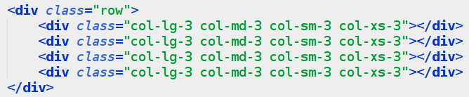

## 0.2 – Grid e Responsividade {#0-2-grid-e-responsividade}

O bootstrap trabalha com um esquema de GRID de 12 colunas, ou seja, toda a página web pode ser dividida em no máximo 12 colunas, e essas colunas variam de acordo com o dispositivo que estiver usando, por exemplo, 1 coluna em um monitor de 17 polegadas é diferente de uma tela de smarthphone de 4 polegadas.

As colunas ficam organizadas dentro de linhas, e elas podem ser especificadas assim:

isso em código é bem simples, supondo que você queira uma linha com 3 colunas, uma de 3, uma 4, com isso já dá 3 + 4 = 7, então faltam 5 pra completar a linha(12).

Agora, perceba a classe que coloquei nas div&#039;s, _col_ significa collumn, ou seja, coluna, o último digito significa o tamanho da div em colunas, e o _lg_ no meio significa o tamanho da coluna para cada dispositivo, vamos entender:

**lg** = large, para telas grandes, full-HD

**md** = medium, para telas medianas, notebook&#039;s

**sm** = small, telas pequenas, tablet&#039;s

**xs** = extra small, telas muito pequenas, smarthphones

Vamos ver se você entendeu, se quisermos criar uma página que tenha 4 div&#039;s de 3 colunas em todas as telas, como fariamos?

Observe:

Claro que algumas vezes isso não fica tão legal, ou seja, as vezes 3 colunas no notebook é legal, mas 3 colunas no smarthphone não fica, então nesse caso, teste o que fica melhor, você pode combinar de acordo com sua necessidade.