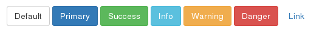
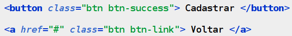
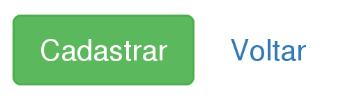
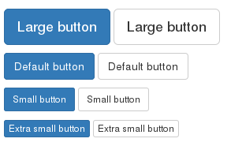
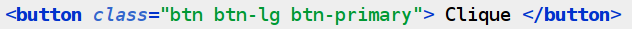
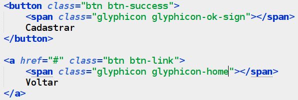
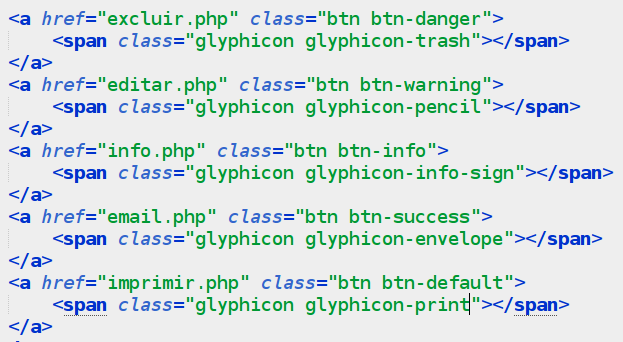
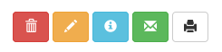

## 0.3 - Componentes {#0-3-componentes}

Conheça alguns componentes a seguir, vamos focar em alguns especificos.

###### 0.3.1 - Buttons {#0-3-1-buttons}

Em relação a cores, existem por padrão:

É bem simples criar um, basta usar a classe especifica para cada cor, veja o exemplo:

Mas também podemos alterar seus tamanhos, veja:

Funciona do mesmo jeito dos anteriores, só que agora utilizando aquele esquema dos tamanhos(lg, md, sm, xs).

Isso criaria um botão grande e azul.

Existem outras configurações de buttons, veja em:

[http://getbootstrap.com/components/#btn-groups](http://getbootstrap.com/components/#btn-groups)

###### 0.3.2 – Ícones {#0-3-2-cones}

O Bootstrap utiliza vários ícones pra embelezar um pouco mais os componentes, e dá pra colocar ícones em vários elementos, em button, em link, em dropdown.

Vamos lá, peguemos aquele código utilizado anteriormente pra fazer botão e alteremos um pouco.

Resultado:

Botões apenas com ícones:

Resultado:

Bem, você pode colocar em menus, em links, onde a criatividade existir e o bootstrap permitir.

Para conhecer mais sobre o bootstrap acesse o site principal:

[http://getbootstrap.com](http://getbootstrap.com/)

E para conhecer as novidades do bootstrap, existe o blog da galerinha que desenvolve o mesmo, veja [http://blog.getbootstrap.com](http://blog.getbootstrap.com/).

Foi um curto, porém bom aprendizado, até o próximo capítulo.