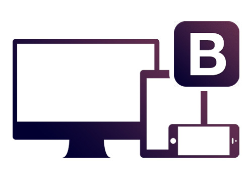

# Capitulo 0 – Bootstrap {#capitulo-0-bootstrap}

**Neste Capítulo você conhecerá um framework pra auxiliar na criação de compontentes pra web com HTML, CSS, e Javascript/Jquery.** Além disso com o bootstrap é possível deixar nossos projetos responsivos.