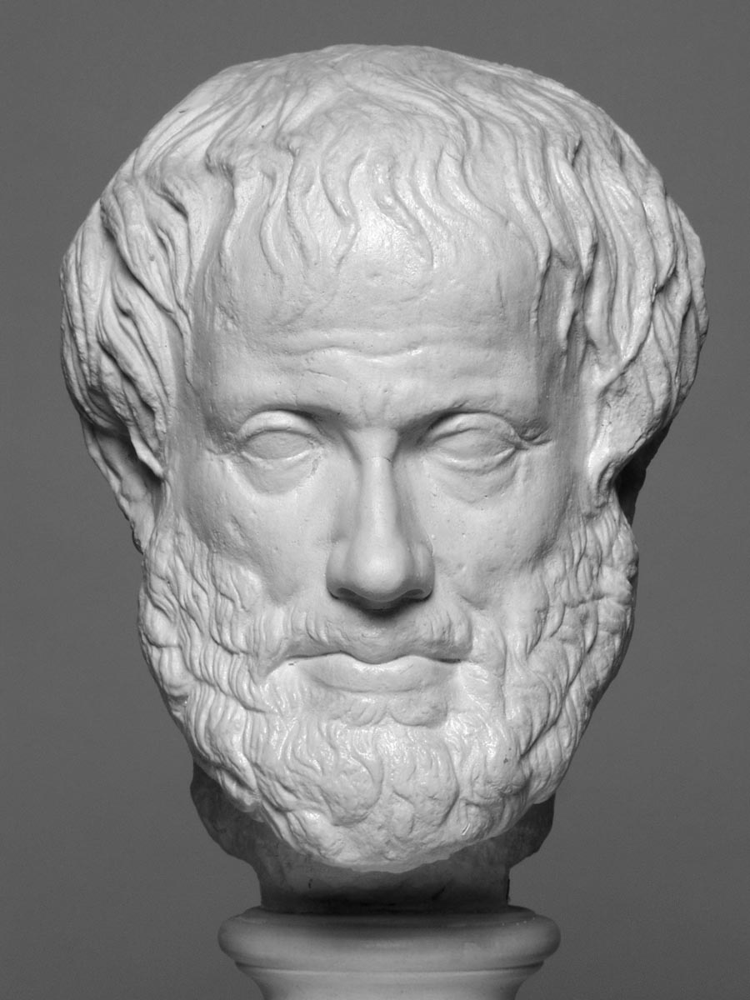

## 1.2 - O que é Lógica {#1-2-o-que-l-gica}

Lógica vem do grego clássico logos (λογική), que significa palavra, pensamento, ideia, argumento, relato, razão lógica ou princípio lógico. É uma parte da filosofia que estuda o fundamento, a estrutura e as expressões humanas do conhecimento. A lógica foi criada por Aristóteles no século IV a.C. para estudar o pensamento humano e distinguir interferências e argumentos certos e errados.

Já que o pensamento é a manifestação do conhecimento, e que o conhecimento busca a verdade, é preciso estabelecer algumas regras para que essa meta possa ser atingida.

Para que tenhamos um bom raciocínio lógico, precisamos praticar diariamente, mudar a maneira de pensar e tomar decisões. Vamos praticar sua lógica, resolva essas questões em conjunto com a turma, procurem solucionar o problema desses casos:

**Quantos Animais de cada espécie Moisés colocou na arca?**

**A mãe de Maria tem 5 filhas: Lalá, Lelé, Lili, Loló, e ?**

**Você entra em um quarto escuro(e sem iluminação)**

**com uma caixa de fosfóro, uma vela, e uma lamparina.**

**Que objeto você acende primeiro?**

