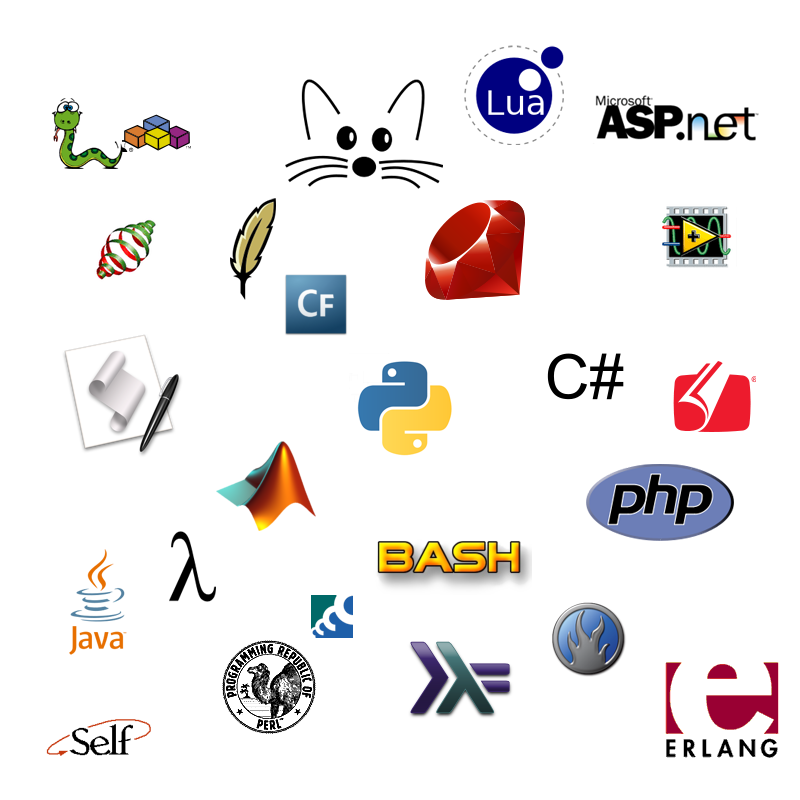

## 1.4 - Lógica de Programação {#1-4-l-gica-de-programa-o}

A lógica de programação é necessária para pessoas que desejam trabalhar com desenvolvimento de sistemas e programas, assim, ela permite definir a sequência lógica para a criação de aplicativos. Significa o uso correto das leis do pensamento, da “ordem da razão”, do processo de raciocínio e simbolização formais na programação de computadores. Com isso criam-­se técnicas que cooperam para a produção de soluções logicamente válidas e coerentes, que resolvam com qualidade os problemas que se deseja programar.

**E então o que é Lógica de Programação?**

_Lógica de programação é a técnica de encadear pensamentos para atingir determinado objetivo._

Usar o raciocínio é algo abstrato, intangível. Os seres humanos têm a capacidade de expressá-lo através de palavras ou escrita, que por sua vez se baseia em um determinado idioma, que segue uma série de padrões(gramática). Um mesmo raciocínio pode ser expresso em qualquer um dos inúmeros, mas continuará representando o mesmo raciocínio, usando apenas outra convenção.

Em programação temos várias linguagens como, java, C, PHP, Python, ShellScript, Lua dentre muitas outras que existem, porém cada uma delas tem um padrão próprio. Essas por sua vez, são muito atreladas a uma grade diversidade de detalhes computacionais, mas com o mesmo raciocínio, seguindo as regras da linguagem, pode ser obtido o mesmo resultado.