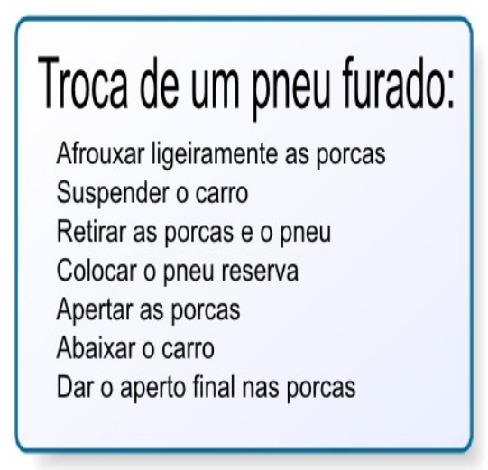
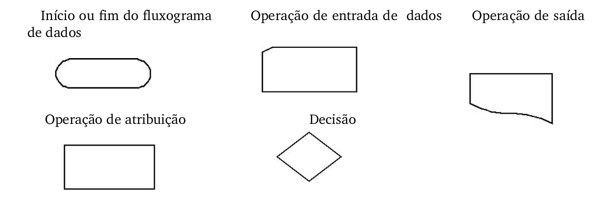
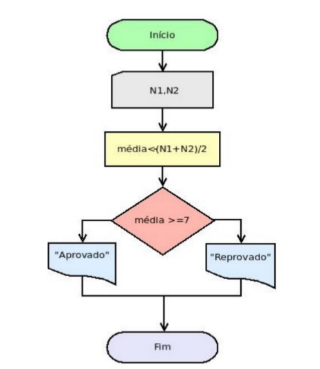
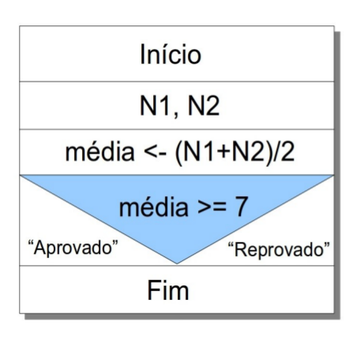
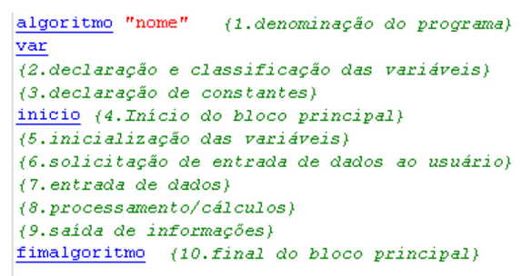
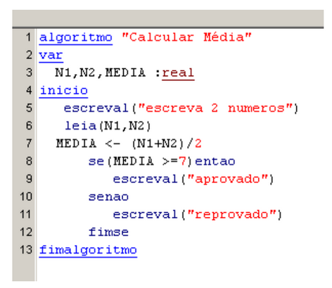

## 1.7 - Maneiras de Representar um algoritmo {#1-7-maneiras-de-representar-um-algoritmo}

Existem diversas formas de representação de algoritmos, mas não há um consenso com relação a melhor delas para ser aplicada na resolução do problema proposto. Algumas formas de representação de algoritmos tratam os problemas apenas em nível lógico, abstraindo-­se de detalhes de implementação muitas vezes relacionados com alguma linguagem de programação específica.

Por outro lado existem formas de representação de algoritmos que possuem uma maior riqueza de detalhes e muitas vezes acabam por obscurecer as ideias principais do algoritmo, dificultando seu entendimento. Sendo assim temos as seguintes formas:

*   Descrição Narrativa;

*   Fluxograma Convencional;

*   **Pseudocódigo** (também conhecido como Português Estruturado ou “Portugol”).

###### 1.7.1 - Descrição Narrativa {#1-7-1-descri-o-narrativa}

Nesta forma de representação os algoritmos são expressos diretamente em linguagem natural. Como exemplo, observe os algoritmos seguintes:

Esta representação é pouco usada na prática porque o uso da linguagem natural muitas vezes dá oportunidade a mas interpretações, ambiguidades e imprecisões.

Por exemplo, a instrução afrouxar ligeiramente as “porcas” no algoritmo da troca de pneus esta sujeita a interpretações diferentes por pessoas distintas. Uma instrução mais precisa seria: “afrouxar a porca, girando-a 30 graus no sentido anti-horário”.

Por mais simples que seja um algoritmo narrativo, pode haver uma grande quantidade de

detalhes, que por sua vez segue um conjunto de regras dentro da sequência a qual pertencem.

###### 1.7.2 - Fluxograma Convencional {#1-7-2-fluxograma-convencional}

É uma representação gráfica de algoritmos onde formas geométricas diferentes implicam ações (instruções,comandos) distintos. Tal propriedade facilita o entendimento das ideias contidas nos algoritmos e justifica sua popularidade. Esta forma é aproximadamente intermediária a descrição narrativa e ao pseudocódigo (subitem seguinte), pois é menos imprecisa que a primeira e, no entanto, não se preocupa com detalhes de implementação do programa, como o tipo das variáveis usadas. Nota­-se que os fluxogramas convencionais preocupam-se com detalhes de nível físico da implementação do algoritmo. Por exemplo, figuras geométricas diferentes são dotadas

para representar operações de saída de dados realizadas em dispositivos distintos.

Existem diversas ferramentas para criação de fluxograma como Jude, Microsoft Visio, Dia(usado no GNU/Linux), dentre outras, cada uma delas tem uma vantagem em particular. Trabalharemos com o editor de diagrama chamado “Dia”, onde podemos facilmente instalar no GNU/Linux e sua licença é de livre acesso. O “BrOffice” também traz estes desenhos pronto para uso.

Observe as principais formas geométrica usadas para representação de Fluxogramas de algoritmos:

Um fluxograma se resume a um único símbolo inicial por onde a execução do algoritmo começa, e um ou mais símbolos finais, que são pontos onde a execução do algoritmo se encerra. Partindo do símbolo inicial, há sempre um único caminho orientado a ser seguido, representando a existência de uma única sequência de execução das instruções. Isto pode ser melhor visualizado pelo fato de que, apesar de vários caminhos poderem convergir para uma mesma figura do diagrama, há sempre um único caminho saindo desta. Exceções a esta regra são os símbolos finais, dos quais não há nenhum fluxo saindo, e os símbolos de decisão, de onde pode haver mais de um caminho de saída (usualmente dois caminhos), representando uma bifurcação no fluxo.

A imagem abaixo é uma representação no diagrama de Chapin. Não abordaremos esse diagrama, nessa apostila.

O exemplo abaixo representa um fluxograma convencional, mostrando a representação do algoritmo de cálculo da média de um aluno sob a forma de um fluxograma.

###### 1.7.3 - Pseudocódigo {#1-7-3-pseudoc-digo}

Esta forma de representação de algoritmos é rica em detalhes, como a definição dos tipos das variáveis usadas no algoritmo. Por assemelha-­se bastante a forma em que os programas são escritos, encontra muita aceitação. Na verdade, esta representação é suficiente-mente geral para permitir a tradução de um algoritmo nela representado para uma linguagem de programação específica seja praticamente direta. A forma geral da representação de um algoritmo na forma de pseudocódigo está ao lado:

Algoritmo é uma palavra que indica o início da definição de um algoritmo em forma de pseudocódigo.

**I – Nome do programa:** é um nome simbólico dado ao algoritmo com a finalidade de distingui-los dos demais.

**II – Var:** consiste em uma porção opcional onde são declaradas as variáveis globais usadas no algoritmo principal;

**III – Início e Fim:** são respectivamente as palavras que delimitam o início e o término do conjunto de instruções do corpo do algoritmo. O algoritmo do cálculo da média de um aluno, na forma de um pseudocódigo, fica da seguinte forma no visualg:

