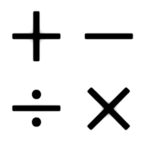

## 2.10 - Operadores {#2-10-operadores}

Os operadores tem seu papel importante dentro de qualquer linguagem de programação. É através deles que podemos realizar diversas operações dentro de um pro-grama, seja ela de atribuição, aritmética, relacional, lógica, dentre outros. Em PHP não é diferente, os operadores são utilizados constantemente, porém existem algumas regras que veremos mais adiante.

###### 2.10.1 – Operadores de String {#2-10-1-operadores-de-string}

São operadores utilizados para unir o conteúdo de uma string a outra, com isso podemos dizer que há dois operadores de string. O primeiro é o operador de concatenação (&#039;.&#039;) que já utilizamos em exemplos anteriores, ele retorna a concatenação dos seus argumentos direito e esquerdo. O segundo é o operador de atribuição de concatenação (&#039;.=&#039;), que acrescenta o argumento do lado direito no argumento do lado esquerdo.

Observe o próximo exemplo:

Nesse exemplo pode-se observar a declaração da variável **_$d,_ **logo após temos uma inicialização e atribuição de concatenação em uma mesma linha, isso é possível em PHP, deixando o código mais otimizado porém menos legível.

###### 2.10.2 - Operadores Matemático s {#2-10-2-operadores-matem-tico-s}

São os operadores para manipular dados numéricos, ou seja, int&#039;s, float&#039;s, e double&#039;s. Veremos isso em 3(três) sub-tópicos:

*   Aritméticos

*   Atribuição

*   Descremento e Incremento

###### 2.10.2.1 – Operadores Aritméticos {#2-10-2-1-operadores-aritm-ticos}

Chamamos de operadores aritméticos o conjunto de símbolos que representa as operações básicas da matemática.

Nesse exemplo fizemos algumas operações, porém ao utilizar parên-teses, estamos determinando quem executa primeiro, no caso a soma de $b+5\.

###### 2.10.2.2 - Atribuição {#2-10-2-2-atribui-o}

O operador básico de atribuição é &quot;=&quot; (igual). Com ele podemos atribuir valores as variáveis como foi visto em exemplos anteriores. Isto quer dizer que o operando da esquerda recebe o valor da expressão da direita (ou seja, &quot;é configurado para&quot;). Mas podemos usar algumas técnicas, observe o exemplo ao lado:

Resultado: a = 9,b = 4

Além do operador básico de atribuição, há &quot;operadores combinados&quot; usados para array e string, eles permitem pegar um valor de uma expressão e então usar seu próprio valor para o resultado daquela expressão.

Por exemplo:

 Resultado: a = 8,b = Bom Dia!

Observe a expressão:**_$a = 3_ **e logo após **_$a+=5._** Isto significa a mesma coisa de **_$a = $a+5,_ **ou, **_$a = 3 + 5._** A ideia pode ser usada para string, como foi feito com a variável **_$b,_** onde **_$b = “Bom” ,_** logo após usamos ponto(.) e igual(=) para concatenar os valores, ficando assim: $b.=”Dia!”. Lembrando que isso significa a mesma coisa que $b = $b.“Dia”.

Observe mais um exemplo :

Resultado: Bom dia turma

Podemos definir uma sequência com duas concatenações, onde $a = “Dia”.“turma” e projeto logo após temos **_$b = “Bom”.“Dia turma”._**

Os operadores de atribuição são usados para economizar linhas de código, deixando assim o código mais funcional e otimizado. A tabela abaixo mostra os principais operadores de atribuição:

Exemplo:

Observe mais um exemplo aplicando os demais operadores.

Resultado:

24

8

2

Vale ressaltar que a cada **_echo,_** o valor de **_$a_ **sofre modificações. Isso devido a atribuição feita após a operação. Usamos o operador ponto(.) para concatenar os valores obtidos com **_&#039;&#039;_ **código usado em HTML para quebra de linha.

###### 2.10.2.3 - Operadores de Incremento e Decremento {#2-10-2-3-operadores-de-incremento-e-decremento}

São operadores usados para atribuir em 1 ou -1 à variável, isso pode ser feito antes ou depois da execução de determinada variável. A tabela abaixo mostra tais operadores:

Exemplo:

Nesse exemplo temos uma forma aplicada do uso de decremento e incremento, lembrando que a variável **_$a_ **pode ter qualquer nome. Também podemos fazer um comparativo com o Pré-incremento ou incremento prefixado com operações que já conhecemos, observe:

###### 2.10.3 – Operadores Relacionais {#2-10-3-operadores-relacionais}

Os operadores relacionais ou conhecidos também como operadores de comparação, são utilizados para fazer determinadas comparações entre valores ou expressões, resultando sempre um valor booleano verdadeiro ou falso(TRUE ou FALSE). Para utilizarmos esses operadores usamos a seguinte sintaxe:

**( valore ou expressão ) + ( comparador) + ( segundo valor ou expressão )**

Observe a tabela abaixo:

Veja um exemplo prático:

$a **Illegal HTML tag removed :**

Compara se **_$a_ **é menor ou igual a **_$b,_ **onde, retorna verdadeiro (TRUE), caso contrário retorna falso (FALSE). Para testarmos essas comparações podemos utilizar o condicional **_“?:”_ **(ou ternário), sua sintaxe é a seguinte:

(expressão booleana) ? (executa caso verdadeiro) : (executa caso falso);

Agora podemos ver um exemplo envolvendo as sintaxes e empregabilidade dos comparadores:

Nesse exemplo declaramos e iniciamos três variáveis. Usamos então o comando **_echo_** para imprimir o resultado, onde o condicional **“?:”** foi utilizado. Iniciamos as comparações de $a, $b e $c, caso a comparação individual retorne **_TRUE,_** imprime verdadeiro, caso retorne **_FALSE,_** imprime falso. Observe que o comparador **_“===”_ **compara o valor e o tipo, retornando **_FALSE_ **por **_$b_ **se tratar de um tipo inteiro, e **_$c_ **um tipo ponto flutuante, já o comparador **_“==”_ **compara somente os valores onde 45 é igual a 45.0 retornando verdadeiro. Também podemos usar o operador **_“!==”_ **onde tem a função semelhante ao operador **_“!=”_ **, mas retorna **_TRUE_ **se os tipos forem diferentes. Se a variável for do tipo booleano, podemos compará-los assim: **$a == TRUE, $a == FALSE**

###### 2.10.4 – Operadores Lógicos ou Booleanos {#2-10-4-operadores-l-gicos-ou-booleanos}

São utilizados para avaliar expressões lógicas. Estes operadores servem para avaliar expressões que resultam em valores lógico sendo verdadeiro ou falso:

| E | AND |
| --- | --- |
| OU | OR |
| NÃO | NOT |

Esses operadores tem a finalidade de novas proposições lógicas composta a partir de outra proposições lógicas simples. Observe:

| &gt;&gt;&gt; Operador &lt;&lt;&lt; | &gt;&gt;&gt; Função &lt;&lt;&lt; |
| --- | --- |
| Não | Negação |
| E | Conjunção |
| Ou | Disjunção |

Com isso podemos construir a Tabela verdade onde trabalhamos com todas as possibilidades combinatórias entre os valores de diversas variáveis envolvidas, as quais se encontram em apenas duas situações (V e F), e um conjunto de operadores lógicos. Veja o comportamento dessas variáveis:

Operação de Negação:

Trazendo para nosso cotidiano:

Considerando que A = “Está chovendo”, sua negação seria : “Não está chovendo”.

Considerando que A = “Não está chovendo” sua negação seria : “Está chovendo”

**Operação de conjunção:**

Trazendo para o nosso cotidiano:

Imagine que acontecerá um casamento:

Considerando que A = “Noivo presente” e B = “Noiva presente”.

Sabemos que um casamento só pode se realizar, se os 2 estejam presente.

**Operação de disjunção não exclusiva:**

Trazendo para o nosso cotidiano:

Imagine que acontecerá uma prova e para realizá-la você precisará da sua Identidade ou título de eleitor no dia da prova.

Considerando que A = “Identidade” e B = “Título de eleitor”.

Sabemos que o candidato precisa de pelo menos 1 dos documentos para realizar a prova.

São chamados de operadores lógicos ou booleanos por se tratar de comparadores de duas ou mais expressões lógicas entre si, fazendo agrupamento de testes condicionais e tem como retorno um resultado booleano.

Na tabela a seguir temos os operadores e suas descrições:

**Dica:** or e and tem procedência maior que &amp;&amp; ou ||, ou seja, em uma comparação extensa, onde ambos estão aplicados. Eles tem prioridade de executar sua comparação primeiro.

No próximo exemplo usamos os operadores lógicos que tem procedência maior:

Em outro exemplo temos os operadores lógicos mais comuns:

Também podemos atribuir valores as variáveis usando os operadores lógicos:

O primeiro **_echo_ **mostra 2 e 0, pois não atribui valor a **_$b_ **uma vez que a primeira condição já é satisfatória.

O segundo **_echo_ **mostra 5 e 3, pois tanto a primeira quanto a segunda precisam ser executadas.

###### 2.10.5 – Precedência de Operadores {#2-10-5-preced-ncia-de-operadores}

Agora já conhecemos uma boa quantidade de operadores no PHP , falta agora conhecer a precedência de cada um deles, ou seja, quem é mais importante, qual operador é avaliado primeiro e qual é avaliado em seguida. Observe o seguinte exemplo:

O resultado será 17, pois o operador * tem maior precedência em relação ao operador +. Primeiro ocorre a multiplicação 2*6, resultando em 12, em seguida a soma de 5 + 12\. Caso deseje realizar a operação com o operador + para só em seguida realizar a operação com o operador *, temos que fazer conforme o exemplo abaixo:

Observe que utilizamos os parênteses para determinarmos quem deve ser executado primeiro, assim alterando o resultado para 42\. Os parênteses determina qual bloco de código executa primeiro, e também serve para isolar determinadas operações. Veja mais um exemplo onde as operações são feitas separadamente. Primeiro executa a soma, em seguida a subtração e só então é executado a multiplicação, imprimindo um resultado final 21:

Exemplo :

A tabela seguinte mostra a precedência dos operadores, da maior precedência no começo para os de menor precedência.

É importante lembrar que primeiro o PHP executará todas as operações que estiverem entre parênteses, se dentro dos parênteses houver diversas operações, a precedência dos operadores será utilizada para definir a ordem. Após resolver todas as operações dos parentes, o PHP volta a resolver o que esta fora dos parênteses baseando-se na tabela de precedência de operadores. Havendo operadores de mesma prioridade o PHP resolverá a operação da esquerda para direita.

Também podemos trabalhar com procedência de parênteses, fazendo associações com um ou mais operadores, observe o seguinte exemplo:

Seguindo a ordem de procedência temos:

1.  1.  5* (6) / (16 ­ ((7)*2)) &gt;&gt;&gt; 5 * 6 / (16 ­ (14)) &gt;&gt;&gt; 5 * 6 / 2 &gt;&gt;&gt; 30 / 2

Resultado : 15

Observe que primeiro executa todos os parênteses, e só então temos as procedência das demais operações.

###### 2.10.6 – Exercícios {#2-10-6-exerc-cios}

1ª) Qual a finalidade dos operadores de strings?

2ª) Quais os operadores de decremento e incremento? Cite alguns exemplos:

3ª) Qual a finalidade do operador aritmético %(módulo)?

4ª) Cite os operadores relacionais, mostre alguns exemplos.

5ª) Quais operadores lógicos ou booleanos?

6ª) Quais os operadores de atribuição?

7ª) Qual a sintaxe do uso de ternário e cite um exemplo?

8ª) Quais os operadores utilizados e o resultado final do código abaixo:

9ª) Observe o código abaixo e diga quais das operações são executadas primeiro, coloque a resposta em ordem decrescente.

**$a = 8*5-3+4/2+19%5/2+1;**

10ª) Faça testes com os operadores relacionais substituindo o operador **&gt;** do código-fonte ao lado.

11ª) Usando o operador de String “.” para montar a seguinte frase ao lado:

12ª) Observe o código-fonte abaixo e diga qual o resultado booleano final. Justifique sua resposta.