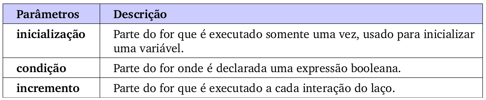
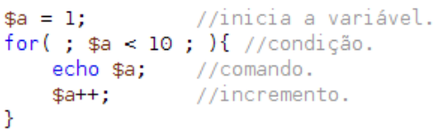
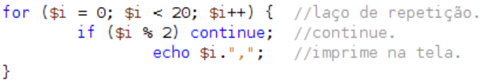

## 2.11 - Estruturas de Controle {#2-11-estruturas-de-controle}

As estrutura de controle de dado são responsáveis pela manipulação dos dados conforme seja necessário na realização de um processamento. Cada instrução programável possui uma lógica de operação e estabelece uma sequencia de ações a serem efetuadas ou verificadas. Quando estivermos criando os algoritmos serão necessárias as manipulações de dados respeitando a sequencia lógica de cada comando, buscando sempre alcançar os objetivos almejados pelos algoritmos. Basicamente as estruturas de controle de dados são de três tipos principais:

­→ **Sequencial**: conjunto de comandos separados por ponto e vírgula (;) que são execu-tados em uma sequência linear de cima para baixo.

­→ **Seleção**: a partir de um teste condicional, uma instrução, ou um conjunto de instruções, podem ser executados ou não, dependendo exatamente do resultado do teste efetuado.

→ **Repetição**: uma instrução ou o conjunto de instruções que será executado repetidamente, de acordo com o resultado de um teste condicional.

As estruturas que veremos a seguir são comuns para as linguagens de programação imperativas, bastando descrever a sintaxe de cada uma delas resumindo o funcionamento. Independente do PHP boa parte das outras linguagens de programação tem estruturas, iguais, mudando apenas algumas sintaxes.

###### 2.11.1 – Estrutura Sequencial {#2-11-1-estrutura-sequencial}

A estrutura sequencial é a mais convencional entre todas as possíveis, pois ela consiste na execução de uma instrução de cada vez, onde o encerramento da primeira instrução permite o acionamento da instrução seguinte, respeitando a ordem de cima para baixo.

###### 2.11.2 – Estruturas de Seleção/Decisão {#2-11-2-estruturas-de-sele-o-decis-o}

Um bloco de estrutura de seleção/decisão consiste de vários comandos agrupados com o objetivo de relacioná-los com determinado comando ou função. Em comandos como **_if_ **, **_switch_ **e em declarações de funções blocos podem ser utilizados para permitir que um comando faça parte do contexto desejado. Blocos em PHP são delimitados pelos caracteres **“{”** e **“}”**. A utilização dos delimitadores de bloco em uma parte qualquer do código não relacionada com os comandos citados ou funções não produzirá efeito algum, e será tratada normalmente pelo interpretador. Outro detalhe importante: usar as estruturas de controle sem blocos delimitadores faz com que somente o próximo comando venha ter ligação com a estrutura.

###### 2.11.2.1 - Simples(IF) {#2-11-2-1-simples-if}

Essa estrutura condicional está entre uma das mais usadas na programação. Sua finalidade é induzir um desvio condicional, ou seja, um desvio na execução natural do programa. Caso a condição dada pela expressão seja satisfeita, então serão executadas a instruções do bloco de comando. Caso a condição não seja satisfeita, o bloco de comando será simplesmente ignorado. Em lógica de programação é o que usamos como **_“SE (expressão) ENTÃO {comando:}”._**

Observe que temos um comando IF, onde é passado a ele uma expressão booleana que retorna verdadeiro ou falso.

O resultado da expressão é FALSE(falso), pois 0 não é maior que 2, fazendo com que o IF não execute o **_echo_ **com “comando1”. Somente o segundo **_echo_ **é executado, pois não pertence ao IF declarado.

Mas se quisermos que mais de um comando pertença a estrutura de controle, será usado blocos de comandos **( { comando; } )**, onde através deles podemos delimitar e organizar os códigos.

No código ao lado, temos um bloco onde inserimos dois comandos. Observe que eles não serão execu-tados, pois a expressão booleana passada para o IF é falsa.

###### 2.11.2.2 - Composta(IF-ELSE) {#2-11-2-2-composta-if-else}

Esta estrutura é bem semelhante a anterior a única diferença é que com **_if-else_ **temos duas possibilidades de saída, onde encontramos algumas regras:

*   Só um bloco pode ser executado: ou do **if** ou o do **else**.

*   Os dois blocos não poderão ser executados juntos.

*   Não existe a possibilidade de não ser executado nenhum dos dois blocos.

A tradução de **if-else** é **_“SE – SENÃO”._**

Sintaxe:

| if( condição ){ | se( condição ) então{ |
| --- | --- |

Exemplo:

Caso a condição não seja satisfatória(FALSE), podemos atribuir outro comando perten-cente ao **IF** chamado **ELSE**, como se fosse a estrutura SENÃO em lógica de programação.

###### 2.11.2.3 - Encadeada(IF-ELSE-IF-IF) {#2-11-2-3-encadeada-if-else-if-if}

Em determinadas situações é necessário fazer mais de um teste, e executar condicional-mente diversos comandos ou blocos de comandos. Isso é o que podemos chamar de “If&#039;s encadeados”, onde usamos a estrutura **_IF-ELSEIF-ELSE_ **, Para facilitar o entendimento de uma estrutura do tipo:

ou

###### 2.11.2.4 - Múltipla Escolha(SWITCH-CASE) {#2-11-2-4-m-ltipla-escolha-switch-case}

Observe que quando temos muitos “if&#039;s encadeados” estamos criando uma estrutura que não é considerada uma boa prática de programação. Para resolver esse problema temos uma estrutura onde sua funcionalidade é semelhante ao **_IF-ELSE-ELSEIF_ **. O comando **SWITCH-CASE** é uma estrutura que simula uma bateria de testes sobre uma variável. Frequentemente é necessário comparar a mesma variável com valores diferentes e executar uma ação especifica em cada um desses valores.

| $numero = 2; | $numero = 2; |
| --- | --- |

Nesse exemplo temos o número = 2, onde o **_switch_ **compara com os **case&#039;s** o valor recebido, o bloco que é executado é do segundo **_case,_** porém os demais também são executados para que tenhamos um resultado satisfatório temos que usar em cada **_case_ **um comando chamado **_break._ **No qual tem a função de parar/interromper o bloco de execução, nesse caso ele interrompe a estrutura assim que algum **_case_ **for executado. Veremos mais sobre **_break_ **no decorrer da apostila.

**Mas o que acontece se não entrar em nenhum case?**

_A resposta é bem simples, nenhum dos blocos seria executado, porém temos um comando onde determi-namos uma opção_ **_padrão_** _caso nenhuma das outras venha ter resultado que satisfaça a expressão passada para o_ **_switch_** _chamada_ **_default_ **_(padrão)_

No exemplo anterior se a variável **_$numero_ **não tivesse um valor satisfatório aos cases, o bloco do **_default_ **seria executado, nesse caso, mostrando “número inválido”.

Além de números podemos também comparar outros tipos como string, pontos flutuantes e inteiros, veja um exemplo abaixo:

Resultado: número inválido

###### 2.11.2.5 - Exercícios {#2-11-2-5-exerc-cios}

1°) Faça um script em PHP que receba um número representado por uma variável e verifique se este número é par ou ímpar e imprima a mensagem na tela.

2°) Crie um script baseando-se na idade de uma pessoa:

| Idade | Resultado |
| --- | --- |
| Menos que 12 | Criança |
| Entre 12 e 18 | Adolescente |
| Entre 18 e 60 | Adulto |
| Mais que 60 | Idoso |

3ª) Faça um script em PHP usando **_switch,_** onde receba uma variável e mostre as seguintes opções:

1 - módulo.

2 - somar.

3 - subtrair.

4 - multiplicar.

5 - dividir.

###### 2.11.3 - Estruturas de Repetição {#2-11-3-estruturas-de-repeti-o}

As estruturas de Repetição, como o próprio nome já diz, servem para repetir um determinado bloco de código, ou seja, gerar um laço de repetição(loop). Muitas vezes nos deparamos com scripts onde um mesmo código se repete muitas vezes, por exemplo, um campo select-option de formulários do html que serve para escolher o “ano de nascimento” que varia de 1900 a 2014, todos sabemos que um para cada número teríamos que criar uma **_option_ **e isso daria muito trabalho, pois seriam 115 options, nesse caso poderíamos usar uma estrutura de repetição para repetir um determinado código 115 vezes, que no caso seria a criação de cada option.

Não só no PHP, mas em outras linguagens temos 4 estruturas de repetição:

*   Repetição com teste condicional no início.

*   Repetição com teste condicional no final.

*   Repetição com variável de controle

*   Estrutura para percorrer arrays

Quando usamos um laço de repetição, podemos determinar quantas vezes ele deve ou não repetir. Isso pode ser feito de forma manual, onde o programador determina onde vai determinar, ou automática onde quem determina o fluxo de execução do código são as funções do PHP, funções estas já existentes.

Para trabalharmos com essa contagem de quantas vezes o laço deve se repetir, usaremos **incremento** ou **decremento** de uma variável conforme vimos antes.

**Dica:** Toda estrutura de repetição requer 3 elementos:

→ de onde vai? (**_início_**) – variável de início

→ pra onde vai? (**_término_**) – condição

→ como vai? (**_passo_**) – incremento ou decremento

###### 2.11.3.1 - Condição no Início(WHILE) {#2-11-3-1-condi-o-no-in-cio-while}

O **_WHILE_ **é uma estrutura de controle similar ao **_IF,_** onde possui uma condição para executar um bloco de comandos. A diferença primordial é que o WHILE estabelece um laço de repetição, ou seja, o bloco de comandos será executado repetitivamente enquanto a condição passada for verdadeira. Esse comando pode ser interpretado como “**_ENQUANTO (expressão) FAÇA { comandos...}_ **”.

| while (condição){ | enquanto(condição) faça{ |
| --- | --- |

Observe o exemplo abaixo:

Resultado: 123456789

O código acima irá contar de 0 até 9, utilizando a dica dada antes temos:

→ **De onde vai?** De 0(zero)

→ **Pra onde vai?** Até 9(nove)

→ **Como vai?** De 1 em 1

Perceba que no código acima o laço irá rodar 10 vezes, e a cada rodada a variável $n será incrementada em 1, fazendo assim com que o código tenha um final garantido.

**Cuidado:** Ao trabalhar com loop&#039;s (laço de repetição), pois caso a condição passada esteja errada, pode ocasionar em um loop infinito fazendo com que o bloco de código se repita infinitamente. Isso pode ocasionar um travamento do navegador ou até mesmo do próprio servidor WEB.

###### 2.11.3.2 - Condição no Final(DO-WHILE) {#2-11-3-2-condi-o-no-final-do-while}

O laço **_do-while_ **funciona de maneira bastante semelhante ao **_while,_** com a simples diferença que a expressão é testada ao final do bloco de comandos. O laço **_do-while_** possui apenas uma sintaxe que é a seguinte:

| do{ | faça{ |
| --- | --- |

Exemplo:

O código resultará na frase “PHP é o Poder!” sendo mostrada 5 vezes.

###### 2.11.3.3 - Variável de Controle(FOR) {#2-11-3-3-vari-vel-de-controle-for}

Outra estrutura de repetição é o for, onde tem a finalidade de estabelecer um laço de repetição em um contador. Sua estrutura é controlada por um bloco de três comandos que estabelecem uma contagem, ou seja, o bloco de comandos será executado determinado número de vezes.

| for(inicialização; condição; incremento){ | Para _inicio_ até _término_ de _passo_ { |
| --- | --- |

Lembrando que o loop do **_for_ **é executado enquanto a condição retornar expressão booleana verdadeira. Outro detalhe importante é que podermos executar o incremento a cada laço, onde possibilitamos adicionar uma variável ou mais. Mostraremos agora um exemplo fazendo um comparativo entre a estrutura de repetição do **_while_ **e também a do **_for_ **de forma prática.

Ambos exemplo s geram o mesmo resultado:123456789

O for não precisa ter necessariamente todas as expressões na sua estrutura, com isso podemos criar um exemplo de for onde suas expressões são declaradas externamente.

Observe nesse exemplo uma proximidade muito grande do comando **_while._** Apesar de ser funcional, não é uma boa prática de programação utilizar desta forma.

###### 2.11.3.4 – Exercícios {#2-11-3-4-exerc-cios}

1°) Faça um script que conte de 1 até 100\.

2°) Faça um script que imprima na tela números de 3 em 3 entre 0 e 99, ex: 0,3,6,9...

3°) Faça um script que conte de -1 até -100\.

4°) Faça um script que imprima na tela somente números pares de 2 até 20\.

5°) Faça um script que receba duas variáveis $a e $b, logo após imprima os números de

intervalos entre eles. Ex: a=5 ,b = 11, imprime : 5,6,7,8,9,10,11.

###### 2.11.3.5 - Percorrer Arrays(Foreach) {#2-11-3-5-percorrer-arrays-foreach}

O **_foreach_ **é um laço de repetição para interação em array&#039;s ou matrizes. Trata-se de um **for** mais especializado que compõe um vetor ou matriz em cada um de seus elementos por meio de sua cláusula **_AS._**

| foreach(array **as** indice **=&gt;** valor){ | Paracada elemento do **array** pegue **indice** e **valor**{ |
| --- | --- |

Exemplo: Resultado:

Outro exemplo:

Resultado:

Perceba que no primeiro exemplo selecionamos em cada elemento do array o índice e o valor, e mostramos ambos, já no segundo exemplo selecionamos apenas o valor de cada elemento do array, mas se quiséssemos poderíamos também selecionar o índice, no caso seria: 0, 1, 2, e 3.

###### 2.11.4 - Break {#2-11-4-break}

Um comando bastante importante é o **_break,_** usado para abortar (parar) qualquer execução de comandos como **_SWITCH, WHILE, FOR, FOREACH,_** ou qualquer outra estrutura de controle. Ao encontrar um break dentro de um desses laços, o interpretador PHP interrompe imediatamente a execução do laço, seguindo normalmente o fluxo do script.

| while.... |
| --- |

Vamos ver um exemplo com o uso de break dentro de um laço de repetição (no caso o for), onde criamos um laço infinito, porém colocamos um if com a condição de parar o laço através do break. Observe:

Podemos notar nesse exemplo a criação de um laço(loop) infinito, que ocorre quando tiramos a condição do **for**, ou atribuímos **“for( ; true ; )”**, porém a condição fica na responsabilidade do **if**, quando o valor de $a é igual a 10, faz com que o **if** execute o **break**, fazendo com que o laço pare de funcionar. Mas se tivéssemos mais de um laço, como poderíamos definir qual deles deixaria de funcionar? Para responder essa pergunta usamos a quantidade de níveis que podem existir em um break, observe o exemplo:

Observe que para definir qual nível podemos parar utilizamos o break, ou seja, o primeiro nível é onde o break está localizado, no exemplo citado temos dois níveis, e determina-mos pelo **_“break 2;”_ **que o segundo **for**( que é o de fora! ) deixaria de funcionar.

###### 2.11.5 - Continue {#2-11-5-continue}

A instrução **_continue,_** quando executada em um bloco de comandos **for/while**, ignora as instruções restantes até o fechamento em **_“}”._ **Dessa forma, o programa segue para a próxima verificação da condição de entrada do laço de repetição, funciona de maneira semelhante ao **break**, com a diferença que o fluxo ao invés de sair do laço volta para o início dele. Veja um exemplo:

 Resultado: 0,2,4,6,8,10,12,14,16,18,

Podemos observar a seguinte lógica no exemplo acima:

→ Criamos um laço que tem 20 interações de repetição.

→ Logo após temos um **if**, onde, quando o resto da divisão por 2 for igual a 0 (numero par), o valor booleano será “false”. Quando não for igual a 0, significa que a variável $i é um número impar( ex: 5%2 = 1), então temos um valor booleano **“true”**. Isso significa que o **if** executa somente quando os números forem ímpares.

→ Adicionamos um **continue**, que ao executar o **if**, faz com que volte novamente para o início do **for**, impedindo de alcançar o **echo** em seguida.

→ Com isso, em vez de mostramos os números impares, imprimimos somente os números pares incluindo o 0\.

→ Resumimos que o código só passa adiante quando o **if** não executa o continue.

Fluxograma:

Assim como o **break**, também podemos definir em qual nível queremos que a execução continue. Veja o exemplo abaixo:

Resultado:

Podemos observar então o uso de continue dentro de um laço infinito. Ele faz com que o laço de nível 3 seja executado toda vez que a execução passe pela linha 10 do código, logo, impede que o programa fique sempre executando dentro do **while** de nível 1\. Com isso, o **while** da linha 4 do código tem um ciclo de vida de 5 laços. Observe também que os dois últimos **echo&#039;**s nunca serão alcançados, pois o comando continue impede que o fluxo do código passe adiante, fazendo voltar ao nível determinado.

Resumindo: O **continue** é usado dentro de estruturas de loops para saltar o resto da execução do loop atual e continuar a execução na avaliação do estado, em seguida, o início da próxima execução.

Fluxograma:

###### 2.11.6 - Exercícios {#2-11-6-exerc-cios}

1ª) Qual a principal finalidade de uma estrutura de controle?

2ª) Qual a principal finalidade de uma estrutura de repetição?

3ª) Crie um código com a um condição ternária onde receba um valor booleano e de acordo com o valor passado na expressão, deve imprimir “sim” ou “não”.

4ª) Com o comando IF e ELSE crie um código que determine se uma expressão é verdadeira ou falsa.

5ª) Qual a finalidade da estrutura de controle SWITCH e cite um exemplo onde comparamos uma opção com 4 casos diferente?

6ª) Crie um contador de 1 até 20 usando a estrutura de repetição WHILE.

7ª) Crie um contador de 1 até 100 usando DO WHILE.

8ª) Crie um contador de 100 até 1 usando FOR.

9ª) Qual a fonalidade de um FOREACH?

10ª) Crie um código onde podemos para a execução de um laço infinito com o uso de BREAK.

11ª) Como podemos determinar o uso de CONTINUE e qual a sua aplicação prática em PHP .

12ª) Crie um código com as seguintes características:

a) Deverá receber um valor inicial e outro final (crie duas variáveis para esse fim).

b) Como o comado FOR crie um laço onde a contagem e determinada pelo valor inicial e final?

c) Dentro do for deverá conter um IF e ELSE responsável por compara os valores passado a ele e imprimir os pares e impares. Exemplo:

d)Exemplo prático: foi passado o numero inicial 8 e o final 15, então o script PHP deverá

imprimir o intervalo entre esse numero ou seja 8,9,10,11,12,13,14,15, mostrando quais deles são pares e quais são ímpares.

1.  1.