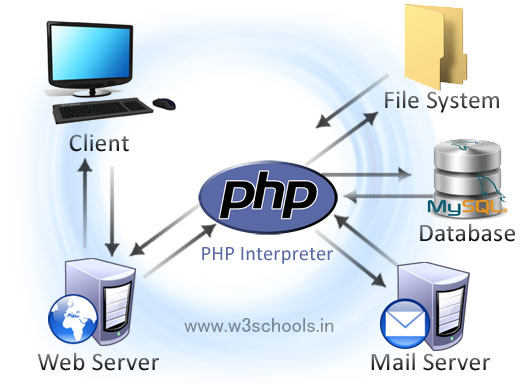

## 2.1 - O que é PHP e um pouco da história {#2-1-o-que-php-e-um-pouco-da-hist-ria}

PHP significa: Hypertext PreProcessor. O produto foi originalmente chamado de “Personal Home Page Tools”, mas como se expandiu em escopo um nome novo e mais apropriado foi escolhido por votação da comunidade. Você pode utilizar qualquer extensão que desejar para designar um arquivo PHP , mas os recomendados foram *.php. O PHP está atualmente na versão 5.6, chamado de PHP5 ou, simplesmente de PHP , mas acabou de ser lançada a versão 7, que causa uma preocupação para os programadores do mundo todo, uma vez que, algumas funcionalidades antigas deixaram de funcionar quando passaram da versão 4 para a 5\.

PHP é uma linguagem de criação de scripts embutida em HTML no servidor. Os produtos patenteados nesse nicho do mercado são as Active Server Pages(ASP) da Microsoft, o Coldfusion da Allaire e as Java Server Pages da antiga Sun que foi comprada pela Oracle. PHP é, as vezes, chamado de “o ASP de código-fonte aberto” porque sua funcionalidade é tão semelhante ao produto/conceito, ou o que quer que seja, da Microsoft.

Exploraremos a criação de script no servidor, mais profundamente, nos próximos capítulos, mas, no momento, você pode pensar no PHP como uma coleção de “supertags”

de HTML que permitem adicionar funções do servidor às suas páginas da Web. Por exemplo, você pode utilizar PHP para montar instantaneamente uma complexa página da Web ou desencadear um programa que automaticamente execute o débito no cartão de crédito quando um cliente realizar uma compra. Observe uma representação de como PHP e HTML se comportam:

O PHP tem pouca relação com layout, eventos ou qualquer coisa relacionada à aparência de uma página da Web. De fato, a maior parte do que o PHP realiza é invisível para o usuário final. Alguém visualizando uma página de PHP não será capaz de dizer que não foi escrita em HTML, porque o resultado final do PHP é HTML.

O PHP é um módulo oficial do servidor http Apache, o líder do mercado de servidores Web livres que constitui aproximadamente 55 por cento da World Wide Web. Isso significa que o mecanismo de script do PHP pode ser construído no próprio servidor Web, tornando a manipulação de dados mais rápida. Assim como o servidor Apache, o PHP é compatível com várias plataformas, o que significa que ele executa em seu formato original em várias versões do UNIX e do Windows. Todos os projetos da Apache Software Foundation – incluindo o PHP – são software de código-fonte aberto.

E como essa suprema linguagem surgiu? Quem foi o JEDI que a inventou?

Rasmus Lerdorf, engenheiro de software, membro da equipe Apache é o criador e a força motriz original por trás do PHP . A primeira parte do PHP foi desenvolvida para utilização pessoal no final de 1994\. Tratava­se de um wrapper de PerlCGI que o auxiliava a monitorar as pessoas que acessavam o seu site pessoal. No ano seguinte, ele montou um pacote chamado de Personal Home Page Tools (também conhecido como PHP Construction Kit) em resposta à demanda de usuários que por acaso ou por relatos falados depararam-se com o seu trabalho. A versão 2 foi logo lançada sob o título de PHP/FI e incluía o Form Interpreter, uma ferramenta para analisar sintaticamente consultas de SQL.

Em meados de 1997, o PHP estava sendo utilizado mundialmente em aproximadamente 50.000 sites. Obviamente estava se tornando muito grande para uma única pessoa administrar, mesmo para alguém concentrado e cheio de energia como Rasmus. Agora uma pequena equipe central de desenvolvimento mantinha o projeto sobre o modelo de “junta benevolente” do código­fonte aberto, com contribuições de desenvolvedores e usuários em todo o mundo. Zeev Suraski e Andi Gutmans, dois programadores israelenses que desenvolveram os analisadores de sintaxe PHP3 e PHP4, também generalizaram e estenderam seus trabalhos sob a rubrica de Zend.com (Zeev, Andi, Zend).

O quarto trimestre de 1998 iniciou um período de crescimento explosivo para o PHP , quando todas as tecnologias de código­fonte aberto ganharam uma publicidade intensa. Em outubro de 1998, de acordo com a melhor suposição, mais de 100.000 domínios únicos utilizavam PHP de alguma maneira. Um ano depois, o PHP quebrou a marca de um milhão de domínios.