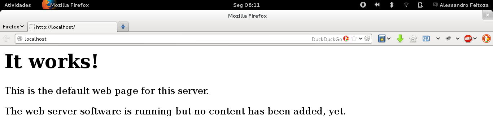
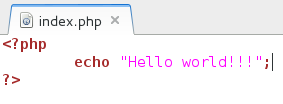
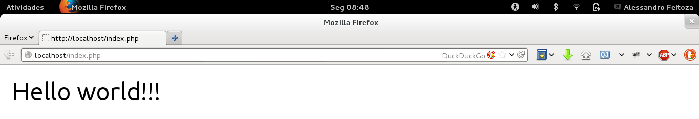

## 2.2 - O que precisa pra desenvolver em PHP – Instalação {#2-2-o-que-precisa-pra-desenvolver-em-php-instala-o}

As requisições são feita de forma cliente servidor, onde um determinado cliente faz uma requisição a um servidor, ele por sua vez recebe a requisição e faz todo o processo em diferentes camadas, retornando somente o que o cliente (browser) solicitou.

Existe uma aplicação chamada de LAMP (GNU/Linux, Apache, MYSQL, PHP) voltada para sistemas operacionais GNU/Linux, como também WAMP (Windows, Apache, MYSQL, PHP) voltada para sistemas operacionais Windows. Eles proporcionam uma simples configuração desses recursos e também muito indicado para ambiente de estudo PHP . Porém não iremos trabalhar com a instalação do LAMP . Pretendemos futuramente trabalhar com frameWorks, então o mais indicado será realizar a instalação e configuração manualmente. Iremos explicar um passo a passo de todo o processo de instalação e configuração desses recursos no tópico seguinte.

###### 2.2.1 – Instalação Apache {#2-2-1-instala-o-apache}

O apache é um dos principais aplicativos para o funcionamento de programas web feito em PHP , ele é um dos responsáveis por compartilhar o nosso site dinâmico para outras outras máquinas, existe duas grandes versões, o apache 2.x e o Apache 1.3, que apesar de antigo ainda é muito utilizado em servidores. O Apache 2 trouxe muitas vantagens, sobretudo do ponto de vista do desempenho além de oferecer novos módulos e mais opções de segurança. Mas sua adoção foi retardada nos primeiros anos por um detalhe muito simples: o fato de ele ser incompatível com os módulos compilados para o Apache 1.3\. Como os módulos são a alma do servidor web, muitos administradores ficavam amarrados ao Apache 1.3 devido à falta de disponibilidade de alguns módulos específicos para o Apache 2\. Iremos trabalhar com o Apache2 em sua versão para GNU/Linux, o procedimento de instalação é simples pois precisamos apenas de uma conexão com a internet e alguns comando, outra forma de instalação e baixando o mesmo no site: [http://httpd.apache.org/](http://httpd.apache.org/) e instalando de forma manual.

Antes de começar qualquer instalação, certifique-se que não existe nenhum pacote corrompido no sistema ou nenhum LAMP instalado e configurado.

Para instalar o Apache precisamos abrir o terminal e atualizar o nosso repositório do GNU/Linux:

**# apt-get update**

Com os pacotes básicos atualizados podemos instalar o apache:

**# apt-get install apache2**

Espere até a conclusão de toda instalação. Por padrão o apache automaticamente inicializa, podendo ser utilizado após isso. Digite no [http://127.0.0.1/](http://127.0.0.1/) ou [http://localhost/](http://localhost/) no browser, deverá aparecer a seguinte tela:

Isto mostra que o apache está funcionando corretamente. Trata-se de um texto dentro de um arquivo HTML que vem como padrão dentro da pasta “/var/www/”, essa é a pasta principal do apache, onde trabalharemos com os arquivos PHP . O apache pode ser configurado de forma que podemos acessar mais de uma página com ip&#039;s ou portas diferentes, ou seja, podemos ter www1,www2, …, www100 em uma mesma máquina servidora fazendo acesso por endereços como [http://localhost:8060](http://localhost:8060/) ou [http://localhost:82](http://localhost:82/), entre outros. Mas trabalharemos apenas com a configuração padrão do apache, uma vez que existe muito conteúdo a respeito desse assunto na internet.

Para obter mais informações consulte a documentação do site oficial do apache: [http://httpd.apache.org/docs/2.2/](http://httpd.apache.org/docs/2.2/)

###### 2.2.2 – Instalação PHP {#2-2-2-instala-o-php}

Para o funcionamento dos programas em PHP precisamos de algumas dependências, onde funcionalidades, funções, classes e suporte a XML então embutidas. Por exemplo, se você quiser utilizar orientação a objeto ou simplesmente fazer uma conexão com o banco de dados, é necessário também a instalação do PHP5, onde algumas bibliotecas serão instaladas para dar suporte aos programas em PHP. Após instalar o apache, faremos a instalação do PHP5 e algumas bibliotecas básicas com o seguinte comando:

**#apt­get** install php5 libapache2­mod­php5 php5­gd curl

**php5­curl php5­xmlrpc php5­ldap php5­odbc**

Atualizaremos o Ubuntu com alguns pacotes de serviço para servidor com o seguinte comando:

**#apt­get install openssh­server unattended­upgrades**

E por fim iremos reiniciar o servidor Apache:

**#/etc/init.d/apache2 restart**

Após a conclusão da instalação, podemos testar criando um arquivo dentro da pasta “var/www”.

Entre na pasta principal:

**$ cd /var/www**

Renomeie o arquivo “index.html” para outro nome:

**# mv index.html qualquer_nome.html**

Qualquer arquivo com o nome “index.html” dentro da pasta www será o primeiro arquivo a ser executado. Lembrando que pode existir somente um arquivo “index.html” na pasta. Após renomear criaremos um novo arquivo.

**# gedit index.php**

Após executar esse comando, digite o seguinte código no editor de texto gedit:

Nesse momento estamos criando uma aplicação PHP que chama o comando _echo “Hello World!!!&#039;”_ que tem como finalidade mostrar a frase “Hello World!!!”. Lembre­-se que toda operação em PHP estará dentro da Tag especial: _“?&gt; &#039;”_ Abra o Browser e digite [http://localhost/](http://localhost/), se tudo estiver correto, observaremos a seguinte tela:

