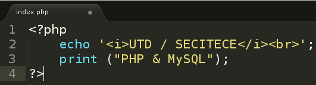

## 2.4 - Saída de Dados {#2-4-sa-da-de-dados}

Usaremos comandos utilizados para gerar uma saída em tela (output). Se o programa PHP for executado via servidor de páginas web (Apache ou IIS), a saída será exibida na própria página HTML gerada no Browser (navegador), assim será mostrado de acordo com o conteúdo existente na saída, por exemplo, se tivermos o seguinte: _“_

_**Illegal HTML tag removed :** PHP is the Power!_

_”&#039;_, será mostrado no navegador apenas a mensagem “PHP is the Power!” passando de um lado pro outro, pois trata-se de um código HTML dentro de comandos PHP . Podemos então usar os seguintes comandos para gerar comandos de saída: **echo** e **print**.

###### 2.4.1 - echo {#2-4-1-echo}

É um comando que imprime uma ou mais variáveis ou textos, onde os mesmos são colocados em aspas simples &#039; &#039; ou duplas “ ”.

Sintaxe:

Resultado:

###### 2.4.2 - print {#2-4-2-print}

É uma função que imprime um texto na tela.

Sintaxe:

Resultado:

Observe um exemplo com o uso do **echo** e do **print**:

