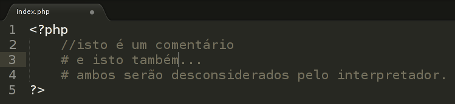
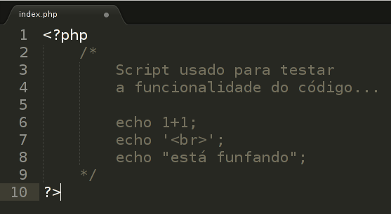
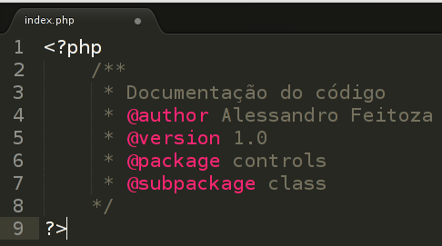

## 2.5- Comentários {#2-5-coment-rios}

Usamos os comentários para nos ajudar a lembrar de partes do código ou para orientar outros programadores ao algoritmo que está sendo escrito.

Para comentar uma única linha nos códigos PHP podemos utilizar tanto o separador “//”

como também “#”, observe o exemplo abaixo:

Lembrando que os comentários são trechos de código que não são executados, onde eles servem somente para quem tem acesso aos códigos-fonte ou está ligado diretamente a programação desse código. Podemos também comentar muitas linhas, isso serve quando queremos que boa parte do código não execute ou simplesmente colocar um comentário mais extenso. Tudo que ficar entre: “/*” e “*/” será um comentário, independente do número de linhas, observe o exemplo abaixo:

