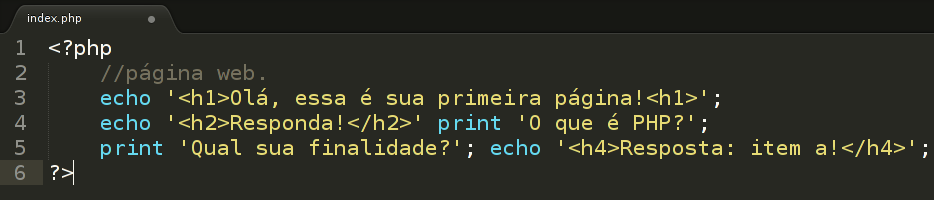

## 2.6 – Estrutura de Dados {#2-6-estrutura-de-dados}

Todo o trabalho realizado por um computador é baseado na manipulação das informações contidas em sua memória. A grosso modo de expressar-se, estas informações podem ser classificadas em dois tipos:

**→ As instruções**, que comandam o funcionamento da máquina e determinam a maneira como devem ser tratados os dados. As instruções são específicas para cada modelo de computador, pois são funções do tipo particular de processador utilizado em sua implementação.

**→ Os dados** propriamente ditos, que correspondem a porção das informações a serem processadas pelo computador.

###### 2.6.1 – Tipos primitivos de dados {#2-6-1-tipos-primitivos-de-dados}

Quaisquer dados a ser tratado na construção de um algoritmo deve pertencer a algum tipo, que irá determinar o domínio de seu conteúdo. Os tipos mais comuns de dados são conhecidos como tipos primitivos de dados, são eles: inteiro, real, numérico, caractere e lógico. A classificação que será apresentada não se aplica a nenhuma linguagem de programação específica, pelo contrário, ela sintetiza os padrões utilizados na maioria das linguagens.

**→ Inteiro:** Todo e qualquer dado numérico que pertença ao conjunto de números inteiros relativos (negativo, nulo ou positivo). Exemplos: {...-4,3,2,1,0,1,2,3,4,...}.

**→ Real:** Todo e qualquer dado numérico que pertença ao conjunto de números reais(negativo, nulo ou positivo). Exemplos: {-15.34, 123.08, 0.005, -12.0, 510.20}.

**→ Numérico:** Trata-se de todo e qualquer número que pertença ao conjunto dos inteiros ou reais, também abrange números binários, octal e hexadecimal.

**→ Caracteres:** são letras isoladas. Exemplo : {&#039;a&#039;, &#039;d&#039;, &#039;A&#039;, &#039;h&#039;}.

**→ Dados literais:** Conhecido também como Conjunto de caracteres ou String, é todo e qualquer dado composto por um conjunto de caracteres alfanuméricos (números, letras e caracteres especiais). Exemplos: {“Aluno Aprovado”, “10% de multa”, “Confirma a

exclusão ??”, “S”, “99­3000­2”, “email”,”123nm”,”fd54fd”}.

**→ Lógico:** A existência deste tipo de dado é, de certo modo, um reflexo da maneira como os computadores funcionam. Muitas vezes, estes tipos de dados são chamados de booleanos, devido à significativa contribuição de Boole a área da lógica matemática. A todo e qualquer dado que só pode assumir duas situações dados biestáveis,algo como por exemplo {0/ 1, verdadeiro/falso, sim/não, true/false }.

Veremos em breve como esses valores serão armazenados e interpretados pelo PHP.

###### 2.6.3 - Exercicios {#2-6-3-exercicios}

1ª) Como podemos definir PHP e qual a sua relação com HTML?

2ª) Descreva um exemplo estrutural relacionando tag&#039;s HTML e delimitações PHP.

3ª) Quais aplicativos básicos podemos instalar para criarmos um servidor de páginas em PHP?

4ª) Em relação ao apache, qual a sua principal finalidade?

5ª) Quais as principais extensões de arquivos PHP e diga a diferença entre elas?

6ª) Crie dois exemplos de código PHP usando seus delimitadores.

7ª) Qual as finalidades de usar comentários dentro de um código-fonte?

8ª) Cite os principais comandos de saída usados em PHP .

9ª) Qual a diferença entre echo e print?

10ª) Observe o seguinte código e diga qual o item correto:

I - Esse código pode ser interpretado pelo apache normalmente.

II - As tag&#039;s HTML são interpretadas pelo servidor.

III - Esse código possui erros.

IV - As tag&#039;s são interpretada pelo navegador do cliente.

a) I, II, IV estão corretas.

b) somente a I está correta.

c) III, IV estão correta.

d) somente IV está correta.

e) I e IV estão corretas.

###### 2.6.3.1 - Práticos {#2-6-3-1-pr-ticos}

11ª) Crie um arquivo PHP dentro da pasta www com o nome index.php, após isso pegue o código anterior e adicione a esse arquivo, defina quais textos são visualizadas em seu navegador. Caso exista erros, faça uma correção.

12ª) Crie dois arquivos diferentes, um com nome index.php, outro com o nome teste.php, após isso inclua o arquivo teste.php dentro do arquivo index.php, ambos arquivos deverá ter no seu código impresso mensagens diferentes utilize o comando print.