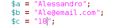

## 2.7 - Variáveis {#2-7-vari-veis}

Variáveis são identificadores criados para guardar valores por determinado tempo. Em PHP elas são declaradas e inicializadas, porém são armazenadas na memória RAM do servidor web. Esse é um dos motivos pelo qual os servidores precisam de grande quantidades de memória. Imagine um servidor com mais de 20 mil acessos simultâneos ao mesmo tempo, onde cada usuário está acessando a mesma página feita em PHP são criadas neste processo variáveis diferentes para cada usuário, logo, isso faz com que muitos processos sejam gerados e processados pelo servidor.

A tipagem em PHP é dinâmica, ou seja, as variáveis não precisam ser obrigatoriamente inicializadas após a declaração. Uma variável é inicializada no momento em que é feita a primeira atribuição. O tipo da variável será definido de acordo com o valor atribuído. Esse é um fator importante em PHP , pois uma mesma variável pode ser de um mesmo tipo ou não, e pode assumir no decorrer do código um ou mais valores de tipos diferentes.

_“__Quando eu vejo um pássaro que caminha como um pato, nada como um pato e grasna como um pato, eu chamo aquele pássaro de pato.”_

**_James Whitcomb Riley_**

Para criar uma variável em PHP precisamos atribuir-lhe um nome de identificação, sempre procedido pelo caractere cifrão ($). Observe o exemplo:

Para imprimirmos as duas variáveis usamos aspas duplas no comando“echo”, no exemplo ao lado temos a saída ao lado:

###### 2.7.1 – Algumas regras sobre variáveis {#2-7-1-algumas-regras-sobre-vari-veis}

→ Nomes de variáveis devem ser significativa e transmitir a ideia de seu conteúdo dentro do contexto no qual está inserido.

→ Utilize preferencialmente palavras em minúsculo(separadas pelo caracter “_”) ou somente as primeiras letras em maiúsculo quando da ocorrência de mais palavras.

→ Nunca inicie a nomenclatura de variáveis com números .

→ Nunca utilize espaço em branco no meio do identificados da variável.

→ Nunca utilize caracteres especiais( ! @ # ^ &amp; * / | [ ] { } ) na nomenclatura das variáveis.

→ Evite criar variáveis com mas de 15 caracteres em virtude da clareza do código-fonte.

Com exceção de nomes de classes e funções, o PHP é case sensitive, ou seja, é sensível a letras maiúsculas e minúsculas. Tome cuidado ao declarar variáveis. Por exemplo a variável **_$codigo_ **é tratada de forma totalmente diferente da variável **_$Codigo._**

Em alguns casos, precisamos ter em nosso código-fonte nomes de variáveis que podem mudar de acordo com determinada situação. Neste caso, não só o conteúdo da variável é mutável, mas também variante (variable variables). Sempre que utilizarmos dois sinais de cifrão ($) precedendo o nome de uma variável, o PHP irá referenciar uma variável representada pelo conteúdo da primeira. Nesse exemplo, utilizamos esse recurso quando declaramos a variável **_$nome_ **(conteúdo de $variável) contendo &#039;maria&#039;.

Resultado = maria.

Quando uma variável é atribuída a outra, sempre é criada uma nova área de armazenamento na memória. Veja neste exemplo que, apesar de **_$b_ **receber o mesmo conteúdo de **_$a,_** após qualquer modificação em **_$b,_** **_$a_ **continua com o mesmo valor, veja:

Para criar referência entre variáveis, ou seja, duas variáveis apontando para a mesma região da memória, a atribuição deve ser precedida pelo operador **_&amp;_**. Assim, qualquer alteração em qualquer uma das variáveis reflete na outra,veja:

No exemplo anterior percebemos que tanto **_$a_ **como **_$b_ **apontam para a mesma referência na memória, dessa forma se atribuirmos um novo valor em **_$a_ **ou em **_$b,_** esse valor será gravado no mesmo endereço, fazendo com que, ambas variáveis possam resgatar o mesmo valor.

###### 2.7.2 – Tipos de Variáveis {#2-7-2-tipos-de-vari-veis}

Algumas linguagens de programação tem suas variáveis fortemente “tipadas”, diferentemente disso o PHP tem uma grande flexibilidade na hora de operar com variáveis. De fato, quando definimos uma variável dando-lhe um valor, o computador atribui-lhe um tipo. Isso permite que o programador não se preocupe muito na definição de tipos de variáveis, uma vez que isso é feita de forma automática. Porém deve ter cuidado com as atribuições de valores, evitando erros na hora de iniciar uma variável em PHP.

###### 2.7.2.1 - Boolean(lógico) {#2-7-2-1-boolean-l-gico}

Um booleano expressa um valor lógico que pode ser verdadeiro ou falso. Para especificar um valor booleano, utilize a palavra-chave **_TRUE_ **para verdadeiro ou **_FALSE_ **para falso. No exemplo a seguir, declaramos uma variável booleana **_$exibir_nome,_** cujo conteúdo é **_TRUE_ **para verdadeiro. Em seguida, testamos o conteúdo dessa variável para verificar se ela é realmente verdadeira imprimindo na tela caso seja. Usaremos a estrutura **IF**, uma estrutura de controle que veremos com mais detalhes no capitulo em breve, para testar a variável.

Observe:

Resultado = 1 (esse valor representa verdadeiro ou true).

Também podemos atribuir outros valores booleanos para representação de valores falso em operação booleanas.

*   Inteiro 0 ;

*   Ponto flutuante 0.0 ;

*   Uma String vazia “ ” ou “0” ;

*   Um array vazio ;

*   Um objeto sem elementos ;

*   Tipo NULL .

###### 2.7.2.2 – Int (inteiro) {#2-7-2-2-int-inteiro}

São os números que pertencem ao conjunto dos números inteiros, abrangendo valores

negativos, positivos e o zero, tratam-se de valores decimais.

###### 2.7.2.3 – Float(Real) {#2-7-2-3-float-real}

Os números do tipo float são números com casas decimais, onde a vírgula é substituída por um ponto(já que nos EUA não se usa “,” para separar casas decimais). Vale salientar que os números do tipo float também podem ser negativos, positivos, ou zero.

Exemplo:

###### 2.7.2.4 – String(cadeia de caracteres) {#2-7-2-4-string-cadeia-de-caracteres}

Uma string é uma cadeia de caracteres alfanuméricos. Para declará-las podemos utilizar aspas simples ( &#039; &#039; ) ou aspas duplas ( “ ” ).

Exemplo:

Observe na tabela abaixo o que podemos também inserir em uma String:

Observe o exemplo:

Resultado:

###### 2.7.2.5 – Array(Matrizes) {#2-7-2-5-array-matrizes}

Array é uma lista de valores armazenados na memória, os quais podem ser de tipos diferentes (números, strings, objetos) e podem ser acessados a qualquer momento, pois cada valor é relacionado a uma chave. Um array também pode crescer dinamicamente com a adição de novos itens. Veremos mais sobre arrays logo a seguir.

###### 2.7.2.6 – Object(Objeto) {#2-7-2-6-object-objeto}

Um objeto é uma entidade com um determinado comportamento definido por seus métodos (ações) e propriedade (dados). Para criar um objeto deve-se utilizar o operador **_new_ **. Para mais informações sobre orientação a objeto, consulte a bíblia do programador PHP no site [http://php.net](http://php.net/) e pesquise sobre object.

###### 2.7.2.7 – Resource(Recurso) {#2-7-2-7-resource-recurso}

Recurso (resource) é uma tipo de dado especial que mantém uma referência de recursos externos. Recursos são criados e utilizado por funções especiais, como uma conexão ao banco de dados. Um exemplo é a função mysql_connect(), que ao conectar-se ao banco de dados, retorna um variável de referência do tipo recurso. Entenderemos mais sobre esse tipo de dado quando estudarmos **_functions._**

###### 2.7.2.8 - Null(Nulo) {#2-7-2-8-null-nulo}

Quando atribuímos um valor do tipo null (nulo) a uma variável estamos determinando que a mesma não possui valor nenhum, e que seu único valor é nulo. Exemplo:

###### 2.7.3 - Conversão de Variáveis {#2-7-3-convers-o-de-vari-veis}

PHP utiliza checagem de tipos dinâmica, ou seja, uma variável pode conter valores de diferentes tipos em diferentes momentos de execução do script. Por este motivo não é necessário declarar o tipo de uma variável para usá-la. O interpretador PHP decidirá qual o tipo daquela variável, verificando o conteúdo em tempo de execução.

Ainda assim, é permitido converter os valores de um tipo para outro desejado, utilizando o typecasting ou a função settype (ver adiante).

Assim podemos definir novos valores para terminadas variáveis:

Exemplos:

Convertendo de ponto flutuante para inteiro.

Resultado: 208

Convertendo de String para Object.

Resultado: stdClass Object ( [scalar] =&gt; Bem vindo ao site! )

Convertendo de inteiro para ponto flutuante.

Resultado: 542

O resultado poderia ser 542.0, mas lembrando que o interpretador do PHP faz outra conversão ao notar que o numero 542.0 tem a mesma atribuição de 542\. O resultado seria o mesmo se tentarmos atribuir $a = 542.0.

###### 2.7.4 - Exercícios {#2-7-4-exerc-cios}

1ª) Qual a principal finalidade de uma variável?

2ª) O que significa tipagem automática.

3ª) Cite algumas dicas importantes na nomenclatura de variáveis:

4ª) Das variáveis abaixo, quais possuem nomenclaturas válidas.

$a___b;$a_1_; $_início;

$@nome;$val_!; $­­nome;

$a_|_;$#valor; $palavra;

$tele#; $123; $__=__;

$VALOR_MAIOR; $____; $all;

Resposta:

__________________________________________________________________________

5ª) Crie dez variáveis atribuindo valores diversos, logo após use o comando echo pra imprimir na tela do browser, exemplo:

6ª) Quais os tipos de variáveis que podemos citar em PHP ?

7ª) Como podemos distinguir um tipo de variável de outro, uma vez que a tipagem é feita de forma automática em PHP ?

8ª) Faça a ligação com os seguintes tipos:

1 ­ $var = ­10;( )ponto flutuante.

2 ­ $var = “palavra”;( )tipo null.

3 ­ $var = 10.22;( )tipo objeto.

4 ­ $var = true;( )String.

5 ­ $var = null;( )numérico.

6 ­ $var = new abc;( )booleano.