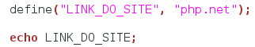
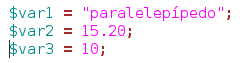

## 2.8 - Constantes {#2-8-constantes}

Constantes são espaços não memória que ao serem inicializados não podem ter seu valor alterado, ou seja, diferente das variáveis que podemos mudar seu valor e tipo a todo momento, nas constantes o valor e o tipo são perpétuos e inalteráveis.

###### 2.8.1 – Constantes Pré-definidas {#2-8-1-constantes-pr-definidas}

O PHP possui algumas constantes pré-definidas, indicando a versão do PHP , o Sistema Operacional do servidor, o arquivo em execução e diversas outras informações. Para ter acesso a todas as constantes pré-definidas, pode-se utilizar a função **_phpinfo(),_** que exibe uma tabela contendo todas as constantes pré-definidas, assim como configurações da máquina, sistema operacional, servidor HTTP e versão do PHP instalada.

###### 2.8.2 – Definindo Constantes {#2-8-2-definindo-constantes}

Para definir constantes utiliza-se a função **_define()._ **Uma vez definido, o valor de uma constante não poderá mais ser alterado. Uma constante só pode conter valores escalares, ou seja, não pode conter nem um array nem um objeto. A assinatura da função define é a seguinte: **_define(“NOME_DA_CONSTANTE”, “valor da constante”)_**

Exemplo:

Resultado: php.net

O nome de uma constante tem quase as mesmas regras de qualquer identificador no PHP . Um nome de constante válida começa com uma letra ou sublinhado, seguido por qualquer número de letras, números ou sublinhados. Você pode definir uma constante utilizando-se da função define(). Quando uma constante é definida, ela não pode ser mais modificada ou anulada.

Estas são as diferenças entre constantes e variáveis:

*   Constantes podem ser definidas e acessadas de qualquer lugar sem que as regras de escopo de variáveis sejam aplicadas;

*   Constantes só podem conter valores escalares;

*   Constantes não podem ter um sinal de cifrão ($) antes delas;

*   Constantes só podem ser definidas utilizando a função define( ), e não por simples assimilação;

*   Constantes não podem ser redefinidas ou eliminadas depois que elas são criadas.

###### 2.8.3 - Exercícios {#2-8-3-exerc-cios}

1ª) Qual a principal finalidade de um constante e como elas são definidas em PHP ?

2ª) Em que momentos precisamos converter uma variável de um tipo em outro?

3ª) Quais os typecasting usados em PHP ?

4ª) Crie uma constante com o comando **define** e imprima com o comando **print()**;

5ª) Crie conversões e imprima na tela com o comando **print()** com as seguintes variável.

a) Converta a variável **$var1** em objeto.

b) Converta a variável **$var3** em ponto flutuante.

c) Converta a variável **$var2** em inteiro.