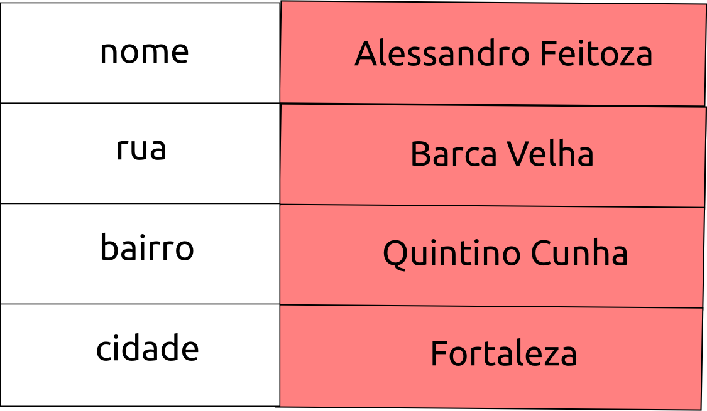

## 2.9 - Arrays {#2-9-arrays}

Um array no PHP é atualmente um conjunto de valores ordenado. Podemos relacionar cada valor com uma chave, para indicar qual posição o valor está armazenado dentro do array. Ele é otimizado de várias maneiras, então podemos usá-lo com um array real, lista (vetor), hashtable (que é uma implementação de mapa), dicionário, e coleção, pilha, fila e provavelmente muito mais. Além disso, o PHP nos oferece uma gama enorme de funções para manipulá-los.

1.  1.  A explicação dessas estruturas estão além do escopo dessa apostila, mas todo conteúdo aqui abordado trás uma boa base para quem estar iniciando o conteúdo de array.

###### 2.9.1 – Criando array Unidimensional {#2-9-1-criando-array-unidimensional}

Arrays são acessados mediante uma posição, como um índice numérico. Para criar um array pode-se utilizar a função **array(&#039;chave&#039; =&gt; “valor”, …)**.

1.  1.  1.  Também conhecidos como vetores, os arrays unidimensionais recebem este nome por terem apenas uma dimensão, no caso, cada elemento do array fica em um espaço definido por um índice.

Exemplo:

ou

Nessa sintaxe temos duas formas de declarar uma variável do tipo array. Onde a chave o índice podem ser de forma automática como no primeiro exemplo, ou manual como no segundo. Outro detalhe importante é que: todo array começa pela chave ou índice de número 0, quando o mesmo não é declarado.

Também temos outras formas de criar um array, onde simplesmente podemos adicionar valores conforma a sintaxe abaixo:

ou

A figura abaixo representa um array que tem como valor representação de cores, e possui dez posições, cada posição representa uma cor, seu índice (chave) vai de 0 até 9.

Veja:

Em código temos:

Veja como mostrar os elementos do array acima:

Dessa forma para acessar o array. Basta determinar o nome do array e qual a chave, onde cada chave tem um valor já determinado. Resultará em um erro o uso de uma chave errada.

###### 2.9.2 - Criando Array Associativo {#2-9-2-criando-array-associativo}

Aos arrays associativos associa-se um determinado valor ou nome a um dos valores do array. O array associativo usa strings como índice, onde cada string pode representar uma chave.

Observe a sintaxe:

Observe que quando usamos arrays associativos, a compreensão é mais fácil, dando mais legibilidade ao código. Porém não é utilizado quando usamos um array dentro de um laço (loop), mas em outros casos sempre é bom utilizar arrays associativos.

Outra forma de iniciarmos um array associativo é adicionar valores conforme abaixo:

A imagem abaixo representa o exemplo anterior:

valores

chaves/índices

Umas das vantagem do array associativo é quando fazemos o acesso ao array, onde temos de forma clara e compreensível o valor que aquela chave pode conter. Como por exemplo nome, onde só vai existir o nome de pessoas.

Veja ao lado um exemplo de acesso ao valores armazenados em um array dessa natureza.

###### 2.9.3 - Arrays Multidimensionais {#2-9-3-arrays-multidimensionais}

Os arrays multidimensionais são estruturas de dados que armazenam os valores em mais de uma dimensão. Os arrays que vimos até agora armazenam valores em uma dimensão, por isso para acessar às posições utilizamos somente um índice ou chave. Os arrays de 2 dimensões salvam seus valores de alguma forma como em filas e colunas e por isso, necessitaremos de dois índices para acessar a cada uma de suas posições. Em outras palavras, um array multidimensional é como um “contêiner” que guardará mais valores para cada posição, ou seja, como se os elementos do array fossem por sua vez outros arrays.

Outra ideia que temos é que matrizes são arrays nos quais algumas de suas posições podem conter outros arrays de forma recursiva. Um array multidimensional pode ser criado pela função **_array()._**

Na figura abaixo temos a representação de um array com duas dimensões.

Uma diferença importante de um array comum para um multidimensio-nal é a quantidades de chaves(índi-ces), onde cada um dos índices repre-senta uma dimensão.

Observe o código da representação ao lado.

Código:

Outra forma de iniciar o array:

Observe que temos uma chave para representar a linha e outra para representar a coluna, assim, determinando uma matriz 4x4\. Podemos ver também que inicializamos um array dentro do outro. Cada sub-array é uma linha, e cada elemento do array maior representa as colunas.

Para acessarmos o valor de um array multidimensional, basta colocarmos as duas ou mais chaves da posição que queremos acessar. É muito semelhante ao array de uma única dimensão.

Observe o acesso aos exemplos anterio-res:

Sintaxe:

Exemplo:

Dessa forma podemos acessar o elemento numérico 1.2 que está guardado na posição linha 1 coluna 2, lembrando que o primeiro elemento de um array é 0.

###### 2.9.4 - Exercícios {#2-9-4-exerc-cios}

1ª) O que é um array, e qual a sua principal finalidade?

2ª)Declare um array chamado “nomes” com 8 posições, e grave nomes de pessoas que você conhece em cada uma delas. E responda:

a) Qual nome é impresso no navegador se colocarmos o código:

**_echo nomes[3];_**

b) O que acontece se chamarmos uma posição que não existe no array, exemplo:

nomes[15];

3ª) O que é um array associativo, dê exemplos:

4ª) O que é um array multidimensional?

5ª) Crie um array “palavras” multidimensional 5x3 com os valores da tabela abaixo, e responda:

a) Crie um código PHP onde com os valores do array possa ser impresso na tela com a frase “_oi, tudo bem com você?_ ”.

b) Utilizando as posições da sequencia [1][0], [1][1], [0][2], [4][2], [4][0], [4][1], [1][2] do array palavras, qual frase podemos formular ?

c) Construa um código PHP para mostrar uma resposta(que está no array) para a pergunta do item **a**.