## 3.1 - Interação PHP – HTML {#3-1-intera-o-php-html}

A interação do PHP com o HTML é principalmente com formulários, pois a principal forma de entrada de dados no PHP é com formulários HTML. Veremos a seguir uma revisão do html, e logo após como enviar e receber esses dados com o PHP.

###### 3.1.1 - Revisão HTML - Formulários {#3-1-1-revis-o-html-formul-rios}

Podemos definir fomulário como um conjunto de campos disponíveis ao usuário de forma agrupada para serem preenchidos com informações requisitada pela aplicação (sistemas web ou páginas). Um formulário é composto por vários componentes, além de

possuir botões de ação, no qual define o programa que processará os dados. Em uma aplicação determinamos então a entrada de dados(no caso os formulários), e a saída de dados, que é toda e qualquer informação apresentada ao usuário pelo browser, de forma que ambas tenham uma ligação lógica e possa retornar um resultado onde todos os componentes da aplicação trabalhem de forma coerente.

###### 3.1.1.1 - Elementos de um formulário {#3-1-1-1-elementos-de-um-formul-rio}

Para criarmos um formulário, utilizamos a tag __e dentro dela podemos dispor diversos elementos, onde, cada um deles representa uma propriedade em particular. A seguir explicaremos os principais componentes de um formulário.

Criando um formulário:

Todo formulário deve conter no mínimo as seguintes características, observe:

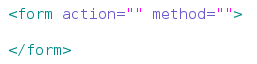

→ **Action:** Para qual arquivo irão os dados.

→ **Method:** Poder ser “POST” ou “GET”, como veremos adiante.

Os elementos do formulário serão preenchidos com os componentes input onde a tag é

__conforme o exemplo abaixo:

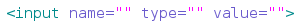

A tag input pode ser composta por vários elementos onde neles podemos definir o tipo,nome, e o valor padrão além de outras propriedades que não apresentaremos nessa

apostila.

→ **name:** o nome do campo, esse atributo é obrigatório, já que o PHP deve saber o nome do campo para pegar seu valor.

→ **value:** este campo é o valor do campo, o valor é normalmente informado pelo usuário, mas em alguns casos esse valor já deve ser pré-definido.

→ **type:** o tipo do campo, esse atributo também é obrigatório, mas se ficar em branco o padrão é do tipo “text”.

Observe a tabela abaixo com a definição dos tipos que podemos atribuir ao elemento type do input.

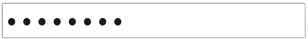

| Type | Descrição | Exemplo |
| --- | --- | --- |
| Text | Elemento utilizado para entrada de texto simples, é um dos mais utilizados. | 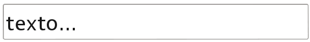 |
| Email | Elemento utilizado para entrada de e-mails. |  |
| Senha | Elemento utilizado para entrada de senhas. |  |
| Checkbox | Utilizado para exibir opções de verifica-ção, muito utilizado para perguntas booleanas. |  |
| Radio | Exibe botões para seleção exclusiva, utilizado para seleção de apenas um item. |  |
| Color | Elemento utilizado para seleção de cores. | 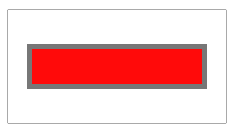 |
| Date | Elemento utilizado para seleção de data. | 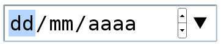 |
| Number | Elemento utilizado para entrada de números. | 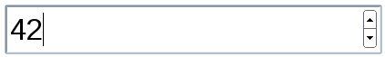 |
| Time | Elemento utilizado para seleção de horas. | 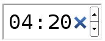 |
| File | Elemento utilizado para anexar arquivos |  |
| Hidden | Elemento utilizado para esconder campos | Não é visivel ao usuário |
| Button | Usado para exibir um botão na tela, porém sua ação é definida por outra linguagem como javascript. |  |
| Reset | Utilizado para limpar todos os campo do formulário, voltando ao valor inicial. |  |
| Submit | Botão usado para submeter os dados do formulário no servidor, ele envia as informações de acordo com as o action e methos informado na tag__ |  |
| Select option | Tipo utilizado para exibir uma lista de valores contido na lista de seleção do usuário (cada valor é guardado em uma tag __, porém só pode ser selecionado uma opção. |  |
| textarea | Área de texto disponibilizado ao usuário, possui múltiplas linhas (rows) e colunas(cols) que podem ser determi-nados dentro de sua tag. Não é um tipo de input, mas é uma tag HTML para formulário. | 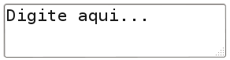 |

###### 3.1.2 - Recebendo dados de Formulários($_GET - $_POST) {#3-1-2-recebendo-dados-de-formul-rios-get-post}

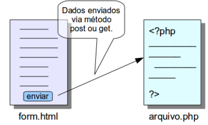Quando falamos em como enviar dados para um formulário, deve vir em mente os métodos **GET** e **POST**, que são os métodos utilizados. Mas quando fazemos uma requisição HTTP, sempre utilizamos um desses métodos, normalmente o GET. Se você digita um endereço na barra de endereço seu navegador e aperta a tecla enter (ou clica no botão ir), o navegador faz uma requisição HTTP para o servidor do endereço digitado e o método dessa requisição é o GET. Se você clica em um link em um site, o navegador também se encarrega de fazer um requisição HTTP com o método GET para buscar o conteúdo da página que você clicou.

Esse mecanismo funciona da seguinte forma. Primeiro temos em um formulário, um botão ou link. Quando clicamos em umas dessas pro-priedades, estamos enviando uma requisição. A forma de enviar pode ser definida pelo método get ou post e deve ser enviada para algum arquivo, que ao receber, processa a informação devolvendo resultado ou não. Observe ao lado:

###### 3.1.2.1 – Método GET {#3-1-2-1-m-todo-get}

O método GET utiliza a própria URI (normalmente chamada de URL) para enviar dados ao servidor. Quando enviamos um formulário pelo método GET, o navegador pega as informações do formulário e coloca junto com a URL de onde o formulário vai ser enviado e envia, separando o endereço da URL dos dados do formulário por um “?” (ponto de interrogação) e “&amp;”.

Quando você busca algo no DuckDuckGo, ele faz uma requisição utilizando o método GET, você pode ver na barra de endereço do seu navegador que o endereço ficou com um ponto de interrogação no meio, e depois do ponto de interrogação você pode ler, dentre outros caracteres, o que você pesquisou no DuckDuckGo.

Abaixo temos um exemplo de uma URL de busca do DuckDuckGo. Observe:

Podemos notar a passagem de um campo chamado “q” e o que foi digitado na busca, “php”.

Recebendo dados via $_GET:

Agora trabalharemos com o arquivo PHP , onde podemos resgatar os valores enviados pelo método $_GET, que no caso é um tipo de array super global(estudaremos mais adiante), sua sintaxe é a seguinte:

**$_GET[&#039;nome_da_campo&#039;]** → retorna o valor passado pelo campo.

**$_GET** → retorna um array com todos os valores enviados e seus supostos índices.

Quando queremos um valor especifico, colocamos o nome da “variável” da URL ou o

nome atribuído na propriedade name do input do formulário.

Exemplo:

URL:

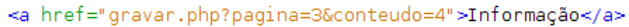

Código:Resultado:

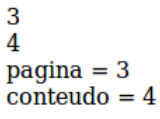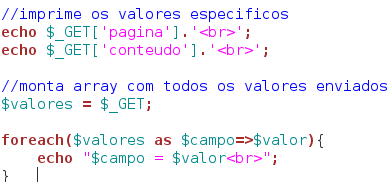

Exemplo com formulário:

Formulário:

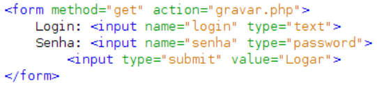

Código:

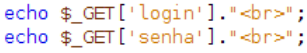

Resultado: _será o que for digitado nos campos..._

###### 3.1.2.2 – Método POST {#3-1-2-2-m-todo-post}

Muito semelhante ao método GET, porém a principal diferença está em enviar os dados encapsulado dentro do corpo da mensagem. Sua utilização é mais viável quando trabalhamos com informações segura ou que poder ser alteradas somente por eventos do Browser. Sintaxe:

**$_POST[&#039;nome_da_campo&#039;]** → retorna o valor passado pelo campo.

**$_POST** → retorna um array com todos os valore enviados e seus supostos índices.

Veja o mesmo exemplo anterior, porém com o uso de POST:

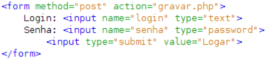Formulário:

Código:

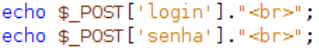

Com o uso do método post, as informações ficam invisíveis ao usuário, isso evita que alguma causa mal-intencionada venha tornar os dados inconsistentes(dados sem fundamentos ou falsos).

###### 3.1.3 - Exercícios {#3-1-3-exerc-cios}

1°) Crie um formulário HTML com os seguintes campos:

“nome”, “endereço”, “e­mail”, “senha”, e o botão “enviar”.

2°) Utilize o método Get para visualizar os dados do array na URL do navegador ao clicar no botão enviar.

3°) Qual a diferença do método POST e GET?

4°) Como podemos receber dados via método GET? Exemplifique.

5°) Como podemos receber dados via método POST?. Exemplifique.

6°) Crie um arquivo chamado dados.php, nesse arquivo deverá conter os seguintes requisitos:

-Os dados do formulário da questão 1 deverá ser enviado para esse arquivo via metodo POST.

-O aquivo dados.php deverá conter cinco variáveis, cada uma para determinado campo, exemplo:

$nome = $_POST[&#039;nome&#039;];

­Os valores deverão ser impresso na tela.