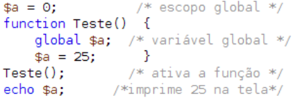
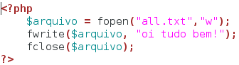

## 3.2 - Especialidades do PHP {#3-2-especialidades-do-php}

Aqui abordaremos algumas functions do PHP, e algumas especialidades da linguagem.

###### 3.2.1 - Functions {#3-2-1-functions}

Quando queremos um código funcional para determinado fim, como por exemplo fazer um cálculo ou alguma interação dentro do PHP , usamos o que chamamos de função. As funções são um pedaço de código com o objetivo específico, encapsulado sob um estrutura única que recebe um conjunto de parâmetros e retorna ou não um determinado dado. Uma função é declarada uma única vez, mas pode ser utilizada diversas vezes. É uma das estruturas mais básicas para prover reusabilidade ou reaproveitamento de código, deixando as funcionalidades mais legíveis.

###### 3.2.1.1 – Declarando uma função {#3-2-1-1-declarando-uma-fun-o}

Declaramos uma função, com o uso do operador **_function_ **seguido do nome que devemos obrigatoriamente atribuir, sem espaços em branco e iniciando sempre com uma letra. Temos na mesma linha de código a declaração ou não dos argumentos pelo par de parênteses **_“()”_ **. Caso exista mais de um parâmetro, usamos virgula **_“(,)”_ **para fazer as separações. Logo após encapsulamos o código pertencente a função por meio das chaves **_({})._** No final, temos o retorno com o uso da cláusula **_return_ **para retornar o resultado da função que pode ser um tipo inteiro, array, string, ponto flutuante etc. A declaração de um retorno não é obrigatório. Observe a sintaxe:

Observe um exemplo onde criamos uma função para calcular o índice de massa corporal de uma pessoa(IMC), onde recebe como parâmetro dois argumentos. Um é a altura representada pela variável $altura e o outro é o peso representada pela variável $peso. Passamos como parâmetros para essa função o peso = 62 e a altura = 1.75\. Observe:

Resultado: 20.244897959184

Nesse exemplo temos a declaração e logo após a chamada da função, onde é nesse momento que passamos os dois parâmetros na ordem que foi declarada na função.

Lembrando que essa ordem é obrigatória. Observe mais um exemplo, onde a função declarada porém não possui a cláusula return.

###### 3.2.1.2 - Escopo de Variáveis em Funções {#3-2-1-2-escopo-de-vari-veis-em-fun-es}

Um conceito importante em programação são os tipos de declarações de variáveis, onde sua visibilidade vai depender de onde ela é declarada. O acesso a essas variáveis podem ser definidas da seguinte forma:

**Variáveis locais →** São aquelas declaradas dentro de uma função e não tem visibilidade

fora dela. Veja um exemplo:

O valor da variável $a não é impresso na tela, pois ela só existe dentro da função, qualquer outra variável declarada com o mesmo nome fora da função é uma nova variável.

**Variáveis Globais** → São variáveis declaradas fora do escopo de uma função, porém tem visibilidade(pode ser acessada) ao contexto de uma função sem passá-la como parâmetro. Para isso declaramos a variável e fazemos a sua chamada logo após com o uso do termo global.

Exemplo:

Resultado: 25

**Variáveis estáticas** → Podemos armazenar variáveis de forma estática dentro de uma função. Significa que ao fazermos isso, temos o valor preservado independente da ultima execução. Usamos o operador **static** para declaramos a variável. Exemplo:

Resultado: 10, 20, 30,

Observe que o valor é mantido e a cada chamada é acrescentado +10, caso não exista o **static** o resultado seria: 10,10,10, .

###### 3.2.1.3 - Passagem de Parâmetro {#3-2-1-3-passagem-de-par-metro}

Como vimos anteriormente, podemos passar ou não parâmetros em uma função, porém existem dois tipos de passagem de parâmetros: Por valor (by value) e por referência (by reference).

**Por Valor** → Normalmente, a passagem de parâmetros em PHP é feita por valor, ou seja, se o conteúdo da variável for alterado, essa alteração não afeta a variável original. Exemplo:

O exemplo acima mostra que passamos um valor de $a para a função, porém o valor temos a garantia que o valor continua integro, ou seja, não foi modificado ao longo do código.

**Por Parâmetro** → Para passarmos um valor por parâmetro, simplesmente colocamos o operador “&amp;” na frente do parâmetro que queremos que o valor seja alterado, observe o exemplo ao lado:

Observe agora nesse último exemplo que apenas acrescentamos o operador “&amp;” no parâmetro que queríamos que alterasse a variável passada como parâmetro, fazendo com que o resultado fosse a soma de 23 + 26 = 49\.

###### 3.2.1.4 - Valor de Retorno {#3-2-1-4-valor-de-retorno}

Toda função pode opcionalmente retornar um valor, ou simplesmente executar os comandos e não retornar valor algum. Não é possível que uma função retorne mais de um valor, mas é permitido fazer com que uma função retorne um valor composto, como listas ou array&#039;s. As operações aritméticas podem ser feita de forma direta no retorno. Observe um exemplo onde temos uma operação direta:

Resultado: 139.5

Também podemos determinar mais de um retorno desde que eles não sejam acessado ao mesmo tempo, observe o exemplo abaixo:

Esse código mostra de forma clara que não existe a possibilidade de retornarmos mais de um **return**, caso isso ocorresse, teríamos um erro, ou não funciona-mento da função.

###### 3.2.1.5 - Recursão {#3-2-1-5-recurs-o}

Esse código mostra de forma clara que não existe a possibilidade de retornarmos mais de um return, caso isso ocorresse, teríamos um erro, ou não funcionamento da função.

Exemplo:

Resultado: 120

###### 3.2.1.6 - Funções nativas {#3-2-1-6-fun-es-nativas}

O PHP possui uma ampla lista de funções com várias possibilidades de uso, tais como: manipulação de strings, de números, de arrays, e até mesmo de funções.

Não seria viável abordar todas essas funções nesta apostila, principalmente porque existem muitas, e a cada versão surgem novas e outras vão se tornando obsoletas, para conhecer as funções nativas do PHP acesse a bíblia do programador PHP: [http://www.php.net/manual/pt_BR/funcref.php](http://www.php.net/manual/pt_BR/funcref.php).

Mas vale saber que para executar uma função basta invocá-la pelo nome e se for necessário passe os parâmetros.

Exemplo:

###### 3.2.1.7 – Exercícios {#3-2-1-7-exerc-cios}

1ª) Diga com suas palavras uma definição para função, e como podemos declará-la em PHP.

2ª) Qual a diferença de variáveis globais para variáveis locais e como podemos defini-las em PHP?

3ª) O que é um parâmetro, e quais os tipos de parâmetros em PHP?

4ª) Quais as funções que podemos usar para criarmos uma função onde seus parâmetros são passados pro argumentos variáveis?

5ª) O que é um valor de retorno e qual o comando usado quando queremos retornar algo dentro de uma função?

6ª) O que é recursão?

7°) Crie uma função que determine se um numero é par ou ímpar. E faça uma chamada

dessa função imprimindo o resultado.

8°) Crie uma função que calcule a fatorial de um número.

9°) Crie uma função para determina se um numero é primo ou não. Numero primo é aquele que possui dois divisores, 1 e ele mesmo. Criem um laço de repetição e use estrutura de controle.

###### 3.2.2 - Arrays Super Globais {#3-2-2-arrays-super-globais}

Variáveis ou arrays super globais, são estruturas nativas da linguagem PHP que tem funcionalidades específicas, e que como o nome já diz são globais, e podem ser acessadas de qualquer lugar do código. Vale lembrar que já conhecemos 2 arrays super globais: $_GET e $_POST.

###### 3.2.2.1 - $_COOKIES {#3-2-2-1-cookies}

**_Cookies_ **são mecanismos para armazenar e consultar informações. Eles são armazenados

na máquina do cliente que acessa o servidor php, e possui várias atribuições que são definidas pelo programador, por exemplo: imagine uma loja virtual, onde o cliente colocou em seu carrinho de compras vários produtos, mas por algum motivo ele não concluiu a compra, tendo que desligar a máquina que foi utilizada para fazer o acesso. No dia seguinte o cliente entra no mesmo site e percebe que todos os itens ainda estão no carrinho de compra do jeito que ele deixou, esperando a conclusão da compra. Nesse exemplo, podemos perceber que as informações foram gravadas na maquina do cliente através dos cookies, que são simplesmente arquivos gerados pela página acessada dentro de alguma pasta do navegador que existe exclusivamente para esses arquivos.

O PHP atribui cookies utilizando a função **_setcookie_ **que deve ser utilizada antes da tag __numa página. Além disso o uso de cookies não é recomendado quando trata-se de informações sigilosas. Os dados dos cookies são armazenados no diretório de arquivos temporários do visitante, sendo facilmente visualizado por pessoas mal intencionadas.

Além da opção “aceitar cookies” que pode ser desativada a qualquer momento pelo visitante. Mas em cada navegador essa opção pode mudar de nome. Observe o comando

abaixo:

**setcookie**

Sua sintaxe possui muitos parâmetros, abaixo está representada todos os valores que podem ser atribuído ao setcookie, mas vale ressaltar que não utilizaremos todos eles, somente os principais, veja sua sintaxe.

Na tabela abaixo temos a descrição de cada atributo.

**tempo_de_vida**

Observe um código onde criamos um cookie:

Criamos então uma string, logo após a função setcookie recebendo como parâmetro somente o seu nome e o valor a ser gravado. Usaremos o navegador Mozilla Firefox para visualizarmos o cookie criado, para isso basta digitar o endereço [http://localhost](http://localhost/) na url, e logo após ir na opção: Ferramentas → Propriedades da página → Segurança → Exibir cookie. Lembre-se de criar o código acima primeiro e depois fazer a chamada pelo navegador de sua máquina. Se tudo ocorrer corretamente deverá aparecer a seguinte tela:

Veja que outras informações como caminho, enviar, e validade não foram especificados, porém podemos determiná-los na hora da criação do cookie dentro do código php. Mostraremos agora um código onde atribuímos o tempo de vida do cookie, para isso devemos capturar o tempo com a função time() atual e somá­lo ao tempo que queremos em segundos, isso faz com que o cookie exista na máquina do cliente de acordo com a quantidade de tempo determinado pelo programador, observe um exemplo onde atribuirmos mais esse parâmetro à função setcookie.

Exemplo:

Esse cookie tem a validade de 3600 segundos(1 hora), com isso concluímos que o navegador fez seu acesso as 14:47:36\. Isso é muito importante para a programação dos cookies. Se quisermos que ele exista por um determinado tempo, temos que calcular tudo em segundos da seguinte forma:

O novo resultado é o seguinte:

$tempo = time()+(3600*24*7);

Esse cookie tem seu tempo de vida de 7 dias, pois 3600 segundos = 1 hora, 24 horas = 1 dia e 7 * horas de um dia resulta em 7 dias.

Exemplo:

Validade:

Acessando um cookie:

Para acessarmos o valor gravado em um cookie é bem simples, basta utilizar usar o array super global $_COOKIE.

Sintaxe:

$_COOKIE[&#039;coloque_aqui_o_nome_do_cookie&#039;]

Exemplo:

Resultado: valores a serem gravados

Observe agora um exemplo de um código utilizado para contar as visitas de um site usando cookie:

O resultado é de acordo com a quantidade de vezes que o cliente entrou no site ou atualizou o mesmo.

###### 3.2.2.2 - $_SERVER {#3-2-2-2-server}

O array super global **$_SERVER** possui muitas informações do servidor, por exemplo caminho do servidor, nome do servidor, endereço, browser, SO, dentre outros.

Exemplo:

Resultado: _localhost_

Para mais informações sobre esta variável acesse:

[http://www.php.net/manual/pt_BR/reserved.variables.server.php](http://www.php.net/manual/pt_BR/reserved.variables.server.php)

###### 3.2.2.3 - $_SESSION {#3-2-2-3-session}

Sessões são mecanismos muito parecidos com os tradicionais cookies. Suas diferenças são que sessões são armazenadas no próprio servidor e não expiram a menos que o programador queira apagar a sessão.

As sessões são métodos de manter(ou preservar) determinados dados a mantê-los ativos enquanto o navegador do cliente (o internauta) estiver aberto, ou enquanto a sessão não expirar (por inatividade, ou porque em algum ponto você mandou que ela expirasse).

Para criarmos uma sessão utilizaremos a função abaixo:

session_start();

Dessa forma estamos iniciando um conjunto de regras. Essa função deve sempre estar no início do código-fonte, com exceção de algumas regras.

Agora trabalharemos com essa sessão, primeiro podemos determinar o tempo de vida da sessão com o seguinte comando:

Neste caso, **session_cache_expire** vem antes de **session_start**. Porque primeiro ele avisa que a sessão, quando iniciada, deve expirar em 5 minutos, e depois a inicia.

Com o array global **_$_SESSION_ **podemos gravar valores na sessão, veja um exemplo:

Criamos uma sessão com o nome _minha_sessao_ (não é uma boa prática de programação usar acentos em nomes de variáveis ou qualquer outra nomeação) e atribuímos a ela o valor gravado na variável string _$var ._ Essas informações ficam gravadas no servidor, logo após podemos resgatar o valor da seguinte forma:

Para resgatar o valor da sessão, basta fazer a chamada do comando passando o nome da sessão, no caso “minha_sessao”. O exemplo anterior foi adicionado em um outro arquivo, por esse motivo temos que chamar novamente a função **_session_start(),_** para trazermos ao arquivo todas as regras usadas em sessão no PHP.

A seguir temos um exemplo com o uso da função **_isset(),_** que verifica se uma variável existe ou não, retornando um valor booleano( true ou false ):

O resultado é de acordo com a existência ou não da sessão.

Para desativarmos uma sessão podemos utilizar dois tipos de mecanismos: um deles é o uso da função **_session_destroy()_ **que tem como finalidade destruir todas as sessões criada pelo usuário, a outra forma é desalocarmos a sessão criada com o uso da função **_unset()._**

Uso de **_session_destroy()_ **:

Uso de **_unset()_ **:

Usamos unset() quando queremos desalocar uma determinada sessão, imaginamos que o usuário ao acessar uma determinada página, tenha criado várias sessões com nomes diferente. Os nomes das sessões são determinada pelo programador, porém ao clicar em um link, o mesmo tem que destruir a seção escolhida. O exemplo abaixo destrói a sessão especificada:

Dessa forma desalocamos(destruirmos) a sessão “minha_sessao”, porém se existirem outras, elas ainda continuarão ativas.

###### 3.2.2.4 - $GLOBALS {#3-2-2-4-globals}

Este é um array superglobal, ou global automática também. Isto simplesmente significa que ela está disponível em todos escopos pelo script. Não há necessidade de fazer global $variable; para acessá-la dentro de uma função ou método.

É também um array associativo contendo referências para todas as variáveis que estão atualmente definidas no escopo global do script. O nome das variáveis são chaves do array.

Exemplo:

Resultado: Rapadura

###### 3.2.2.5 – Outros Super Globais {#3-2-2-5-outros-super-globais}

Para conhecer outros arrays superglobais acesse:

[http://www.php.net/manual/pt_BR/language.variables.superglobals.php](http://www.php.net/manual/pt_BR/language.variables.superglobals.php)

###### 3.2.2.6 - Exercícios {#3-2-2-6-exerc-cios}

1°) Qual a finalidade da variável global **$_SERVER[&#039;HTTP_USER_AGENT&#039;]**?

2°) Crie um **cookie** gravando nele o seu nome, logo após abra o Firefox e exiba o valor gravado.

3°) Crie um arquivo chamado “criar_sessao.php”, utilize comando PHP para cria uma seção com a

durabilidade de 3 minutos e adicione o valor “sessão ativa”.

4°) Crie um novo arquivo chamado “ler_sessao.php” para verificar se a sessão criada na questão 3 existe ou não. Utilize o comando **$_SESSION** para ler o valor nela contido e imprima na tela.

###### 3.2.3 - Manipulação de Arquivos e Diretórios {#3-2-3-manipula-o-de-arquivos-e-diret-rios}

Assim como outras linguagens de programação, é muito importante trabalharmos com manipulações de arquivos e diretórios em PHP, onde temos a possibilidade de manipular um arquivo ou diretório dentro do servidor web, podendo criar arquivos responsáveis por guardar informações referentes aquele sistema ou página. Essas informações podem ser resgatadas futuramente, ou simplesmente são informações que ao invés de serem gravadas no bando de dados, foram gravadas em um arquivo ou log(arquivos que grava informações sobre o sistema, erros etc...).

Ao trabalhar com arquivos, no mínimo duas operações devem ser realizadas: abrir e fechar o arquivo.

###### 3.2.3.1 - Criando e Abrindo um Arquivo. {#3-2-3-1-criando-e-abrindo-um-arquivo}

O comando utilizado para criar um arquivo é o mesmo que usamos para abri-lo, porém no GNU/Linux temos que dar permissões a pasta no qual o arquivo vai ser guardado.

Abra o konsole ou terminal do seu sistema(GNU/Linux). Digite:

chmod 777 /var/www

O comando **chmod 777** dá todas as permissões possíveis na pasta www onde trabalharmos na criação de nossos arquivos.

Para abrir ou criar um arquivo utilizaremos o seguinte comando abaixo:

fopen

Com esse comando podemos abrir um arquivo e retornar um identificador. Sua sintaxe e a seguinte:

$identificador = fopen(“string_do_arquivo”,“modo_do_arquivo”)

**_string_do_arquivo_** → é definido como o nome do arquivo mais a sua extensão, isso incluindo o caminho onde esse arquivo é localizado ou não, por exemplo:

“/home/aluno/meu_arquivo.txt”

Podemos observar um arquivo criado dentro da pasta alunos com o nome _meu_arquivo.txt_.

**_modo_do_arquivo_ **→ nesse parâmetro podemos determinar a forma que o arquivo vai ser aberto com os seguintes valores:

“r” → **read**, este modo abre o arquivo somente para leitura.

“w” → **write**, abre o arquivo somente para escrita, caso o arquivo não exista, tenta criá-lo.

“a+” → **append**, abre o arquivo para leitura e escrita, caso o arquivo não exista, tenta criá-lo.

Existem outros modos, mas trabalharemos somente com estes.

**Dica:** para trabalharmos com arquivos é sempre importante sabermos se a pasta ou o arquivo tem permissões dentro do Linux, caso isso não aconteça, o arquivo não será criado, lido ou até mesmo gravado.

Veja um exemplo do uso do comando fopen:

Caso o arquivo não exista, ele é criando dentro da pasta onde o arquivo *.php foi criado, ou seja, no nosso exemplo o arquivo se chama index.php e estar dentro da pasta www, após executamos esse comando teremos um novo arquivo com o nome meu_arquivo.txt.

###### 3.2.3.2 - Gravando em um arquivo. {#3-2-3-2-gravando-em-um-arquivo}

Após o uso do comando fopen, temos um identificador apontando para o arquivo, e com ele que podemos fazer alterações ou manipulações. Podemos gravar dados dentro do arquivo com o uso do seguinte comando: **_fwrite_**

sintaxe:

fwrite(“indentificador”,“conteúdo”)

identificador → é o parâmetro retornado pelo comando fopen.

conteúdo → é o conteúdo a ser gravado no arquivo.

Vale ressaltar que para podermos gravar no arquivo ele deve ter permissão dentro do GNU/Linux e além disso ter como parâmetro “w” ou “a+” passado para o comando fopen.Observe um exemplo onde escrevemos(gravamos) duas linhas dentro de um arquivo de texto criado com os comando visto até agora:

Exemplo:Resultado:

O uso de “\n” antes da palavra rua faz com que ocorra uma quebra de linha escrevendo o resto do conteúdo na linha abaixo. Após a execução do script (colocando [http://localhost](http://localhost/) no navegador e o nome do script criado), abrimos o arquivo de texto(meu_arquivo.txt) com um editor e percebemos o resultado final.

Observe mais um **_exemplo:_**Resultado:

No exemplo, fizemos a chamada do comando **fwrite** três vezes e escrevemos a cada chamada um valor diferente concatenando com “\n”.

###### 3.2.3.3 - Fechando um arquivo. {#3-2-3-3-fechando-um-arquivo}

Até agora trabalhamos com o comando fopen e não fechamos o arquivo, simplesmente abrimos e executamos os demais comandos. Isso faz com que, caso tenhamos de usar o mesmo arquivo em outra parte do código, ele não poderá ser utilizado, pois para isso é preciso fechá-lo para ele poder ser aberto novamente em outra parte do código. Para isso usamos o seguinte comando: **fclose**

sintaxe:

fclose(“indentificador”)

exemplo:

Toda vez que abrimos um arquivo com fopen, devemos fechá-lo com o comando fclose conforme o exemplo ao lado.

###### 3.2.3.4 - Lendo um arquivo. {#3-2-3-4-lendo-um-arquivo}

Após abrirmos um arquivo, outra operação que podemos efetuar é a leitura do conteúdo existente no arquivo. Essa operação é feita linha por linha, onde podemos resgatar valores existentes de acordo com a chamada do comando fread ou o índice do array criado pelo comando **file**.

Este comando lê um arquivo e retorna um array com todo seu conteúdo, de modo que a cada posição do array representa uma linha do arquivo começando pelo índice 0.

sintaxe:

$array = file(“string_do_arquivo”)

string_do_arquivo → da mesma forma que é definida no comando fopen, usa-se o caminho com o nome do arquivo ou simplesmente o nome do arquivo caso ele exista na mesma pasta onde o arquivo PHP que contém o comando foi criado.

Exemplo:Resultado:

Nesse exemplo utilizamos o arquivo anterior onde foi escrito três linhas, porém efetuamos a leitura somente da linha 1 (índice 0) e linha 2 (índice 1). Oura forma é percorrer o array usando um foreach(), dessa forma podemos ler todas as linhas existentes no arquivo, veja:

Exemplo: Resultado:

###### 3.2.3.5 - Renomeando e Apagando um Arquivo {#3-2-3-5-renomeando-e-apagando-um-arquivo}

Em PHP também é possível copiarmos um arquivo de uma origem para um determinado destino, como também apagar esse arquivo. Para isso usamos os seguintes comando:

copy

Cria um arquivo para outro local/nome. retornando um valor booleano verdadeiro(true) caso a copia tenha ocorrido sem eros ou falhas, caso contrário retorna falso(false). Sintaxe: **copy(“string_origem”, ”string_destino”)**

exemplo:

Caso tudo ocorra corretamente, o resultado apresentado no navegador é “Cópia efetuada”, e será criado uma cópia dentro da pasta com o nome “meu_novo_arquivo.txt”. Vale lembrar que podemos também passar o caminho completo para onde deve ser copiado, como por exemplo:

/home/aluno/meu_novo_arquivo.txt

Para renomearmos um arquivo usamos:

rename

sintaxe:

rename(“nome_do_arquivo”, “novo_nome”)

Para apagarmos um arquivo usamos:

unlink

sintaxe:

unlink(“nome_do_arquivo”)

Observe um exemplo, onde renomeamos o arquivo “meu_novo_arquivo.txt” para “arquivo_texto.txt” e apagamos o arquivo “meu_arquivo.txt”:

Após executarmos isso no navegador, percebemos as mudanças ocorridas dentro do diretório.

###### 3.2.3.6 - Manipulando Diretório. {#3-2-3-6-manipulando-diret-rio}

Alguns comandos básicos são necessários para manipulação de diretórios, mostraremos apenas como obter o diretório atual, como criar e apagar um diretório, para isso usamos os seguintes comandos:

mkdir

Cria um diretório de acordo com a localização e o modo. Sintaxe:

mkdir(“string_localização”, “int_modo”);

**_string_localização_**→ é definido como o caminho com o nome do diretório,ou somente o nome.

**_int_modo_** → é onde definimos as permissões de acesso(como se fosse o chmod do GNU/Linux).

Dessa forma podemos criar um diretório e já atribuirmos as permissões a ele.

Getcwd

Retorna o diretório corrente, este comando é usado caso precise obter o diretório onde o arquivo PHP que possui este comando está guardado.

sintaxe:

getcwd()

rmdir

Apaga um diretório. Sintaxe:

rmdir(“nome_diretório”);

Observe o exemplo envolvendo os três comandos abaixo:

Resultado:

Observe que o comando getcwd obtêm o caminho completo de onde o arquivo PHP que contém o código-fonte estar guardado.

###### 3.2.3.7 – Exercícios {#3-2-3-7-exerc-cios}

1°) O que é manipulação de arquivos?

2°) Observe o código­-fonte abaixo:

a) Que tipo de arquivo é gerado na linha 2 e aonde o mesmo é criado?

b) Que o parâmetro “w” da linha 2 do código representa?

c) Qual a finalidade do comando fwrite da linha 3 do código?

d) Qual o principal motivo de fecharmos o arquivo com o comando fclose da linha 4 do código?

Crie um arquivo de texto chamado “frases.txt” usando o comando fopen, e responsa as questões 3,4,5,6,7

3°) Grave uma mensagem dentro do arquivo criado.

4°) Com base no arquivo criado, utilize o comando fwrite para ler o mesmo imprimindo na tela do navegador o conteúdo do arquivo.

5°) Abra o arquivo “frases.txt” com um editor de texto, adicione cinco palavras, cada uma em uma linha diferente, após isso utilize o comando file, para efetuar a leitura do arquivo, e imprima na tela a primeira e ultima palavras com o comando echo.

6°) Crie uma cópia do arquivo renomeando o novo arquivo para “palavras.txt”.

7°) Agoraapague o arquivo “frases.txt” com o comando _unlink._

8°) Crie um diretório com o comando mkdir e copie o arquivo “palavras.txt” para a pasta criada e apague o anterior, tudo com comandos PHP .

9°) Crie um código que imprima na tela todo o cominho de pastas onde se localiza o arquivo “palavras.txt”.

###### 3.2.4 - Requisição de Arquivos {#3-2-4-requisi-o-de-arquivos}

Assim como em muitas outras linguagens de programação também é possível incluir dentro de um script PHP outros arquivos contendo outras definições, constantes, configurações, ou até mesmo carregar um arquivo contendo a definição de uma classe. Para isso podemos usar os seguintes comandos:

###### 3.2.4.1 - INCLUDE {#3-2-4-1-include}

include**Illegal HTML tag removed :** :

A instrução **_include()_ **inclui e avalia o arquivo informado. O código existente no arquivo entram no escopo do programa que foi inserido, tornando-se disponível a partir da linha em que a inclusão ocorre. Se o arquivo não existir, produzirá uma mensagem de advertência(warning).

Exemplo onde temos dois arquivos:

código do arquivo_teste.php código do arquivo index.php

Resultado:

Nesse exemplo podemos notar que o código existente no “arquivo_teste.php” foi inserido dentro do arquivo index.php, tendo como resultado a execução dos dois códigos como se fossem apenas um, esse recurso é muito utilizado, pois podemos incluir até mesmo códigos de páginas inteiras em um arquivo.

###### 3.2.4.2 - REQUIRE {#3-2-4-2-require}

require**Illegal HTML tag removed :** :

Comando muito parecido ao **include**. Difere somente na manipulação de erros. Enquanto o include produz uma warning, o require uma mensagem de Fatal Error caso o arquivo não exista.

Sintaxe:**require****&#039;nome_do_arquivo.php&#039;****;**

###### 3.2.4.3 - INCLUDE_ONCE {#3-2-4-3-include-once}

include_once**Illegal HTML tag removed :** :

Tem funcionalidade semelhante ao **include**, a diferença é que caso o arquivo informado já esteja incluído, esse comando não refaz a operação, ou seja, o arquivo é incluído apenas uma vez. Este comando é útil para garantir que o arquivo foi carregado apenas uma vez. Caso o programa passe mais de uma vez pela mesma instrução, evitará sobreposição de arquivo.

Sintaxe:**include_once****&#039;nome_do_arquivo.php&#039;****;**

###### 3.2.4.4 - REQUIRE_ONCE {#3-2-4-4-require-once}

require_once**Illegal HTML tag removed :** :

Tem funcionalidade parecida com o comando **require.** A diferença é justamente caso o arquivo já tenha sido incluído no programa, pois ele não carrega novamente o código. É muito semelhante ao include_once, evitando redeclarações ou sobreposições, porém a mensagem exibida caso o arquivo não exista é de Fatal Error.

Sintaxe:**require_once****&#039;nome_do_arquivo.php&#039;****;**